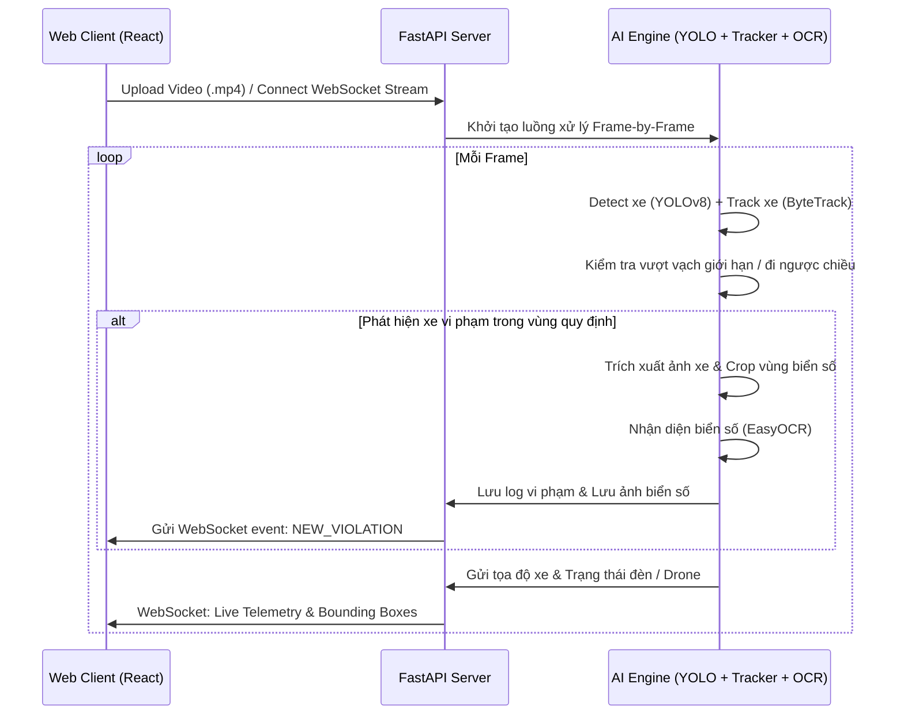

# PHẦN 1: TỔNG QUAN DỰ ÁN & FRONTEND CORE

## 1. TỔNG QUAN DỰ ÁN

### Kiến trúc hệ thống
Hệ thống SENTINEL là một nền tảng giám sát giao thông thông minh thời gian thực (Real-time Intelligent Traffic Surveillance System). 
Nền tảng tích hợp dữ liệu truyền tải trực tiếp (Stream) từ thiết bị bay không người lái (Drone/UAV) và camera cố định, xử lý qua pipeline AI hiệu năng cao để phát hiện phương tiện, theo dõi (tracking), nhận dạng biển số (OCR), và phát hiện các hành vi vi phạm luật giao thông.

### Công nghệ sử dụng
- **Frontend**: React 19, Vite, TypeScript, TailwindCSS v4, React Router Dom v7, Zustand (State Management), Framer Motion (Animations), Recharts (Biểu đồ phân tích).
- **Backend**: Python 3.11, FastAPI (High-performance Async Framework), Uvicorn.
- **AI / Machine Learning**: PyTorch, YOLOv8 (Ultralytics) cho phát hiện phương tiện, EasyOCR/Plate Detector cho nhận dạng biển số xe, Supervision cho tracking & phân tích khu vực (Polygon/Line crossing).
- **Giao thức**: WebSockets cho luồng streaming tọa độ và frame ảnh real-time, REST API cho cấu hình, upload video và tra cứu vi phạm.

### Sơ đồ luồng hoạt động


### Danh sách module chính
1. **Live Stream Telemetry**: Nhận và vẽ thời gian thực các bounding box xe, biểu đồ mật độ giao thông, vận tốc trung bình qua WebSockets.
2. **AI Detection & Violation Alerts**: Module tự động phát hiện vi phạm (không đội mũ bảo hiểm, lấn làn, đi ngược chiều, vượt đèn đỏ) và báo động trực quan.
3. **Plate OCR Reader**: Module nhận dạng biển số xe vi phạm tự động từ frame ảnh crop, lưu trữ lịch sử để tra cứu.
4. **Drone Simulator & Mission Control**: Module giả lập điều khiển drone, lập bản đồ hành trình bay và hiển thị trạng thái camera từ xa.
5. **Traffic Analytics Dashboard**: Phân tích dữ liệu lịch sử bằng biểu đồ trực quan (mật độ theo giờ, tỷ lệ vi phạm, phân loại phương tiện).

### Cây thư mục dự án
```text
smart-traffic-monitoring/
├── backend/
│   ├── app/
│   │   ├── api/
│   │   │   ├── __init__.py
│   │   │   ├── routes_health.py
│   │   │   ├── routes_upload.py
│   │   │   └── routes_websocket.py
│   │   ├── services/
│   │   │   ├── __init__.py
│   │   │   ├── ocr_service.py
│   │   │   ├── plate_detector.py
│   │   │   ├── tracking_service.py
│   │   │   ├── video_processor.py
│   │   │   ├── violation_service.py
│   │   │   ├── websocket_manager.py
│   │   │   └── yolo_service.py
│   │   ├── utils/
│   │   │   ├── __init__.py
│   │   │   ├── geometry_utils.py
│   │   │   ├── image_utils.py
│   │   │   └── video_utils.py
│   │   ├── __init__.py
│   │   ├── config.py
│   │   └── main.py
│   ├── models/
│   │   ├── best.pt
│   │   └── plate_detector.pt
│   ├── outputs/
│   ├── uploads/
│   ├── requirements.txt
│   ├── run.py
│   ├── start.bat
│   └── (các script diagnose/test...)
├── src/
│   ├── assets/
│   ├── components/
│   │   ├── header/
│   │   │   └── Header.tsx
│   │   ├── monitor/
│   │   │   └── VideoCanvas.tsx
│   │   ├── shared/
│   │   │   ├── EmptyState.tsx
│   │   │   └── ProcessingOverlay.tsx
│   │   ├── sidebar/
│   │   │   └── Sidebar.tsx
│   │   └── upload/
│   │       └── VideoUploader.tsx
│   ├── hooks/
│   │   ├── index.ts
│   │   ├── useVideoUpload.ts
│   │   └── useWebSocket.ts
│   ├── i18n/
│   │   └── vi.ts
│   ├── layouts/
│   │   └── MainLayout.tsx
│   ├── pages/
│   │   ├── AIAssistant.tsx
│   │   ├── AIDetection.tsx
│   │   ├── Dashboard.tsx
│   │   ├── DroneControl.tsx
│   │   ├── LiveMonitoring.tsx
│   │   ├── Login.tsx
│   │   ├── Register.tsx
│   │   ├── Settings.tsx
│   │   ├── SystemArchitecture.tsx
│   │   ├── TrafficAnalytics.tsx
│   │   └── ViolationsOCR.tsx
│   ├── services/
│   │   ├── api.ts
│   │   └── websocket.ts
│   ├── store/
│   │   ├── analyticsStore.ts
│   │   ├── index.ts
│   │   ├── trackingStore.ts
│   │   ├── trafficStore.ts
│   │   ├── uploadStore.ts
│   │   └── websocketStore.ts
│   ├── types/
│   │   ├── index.ts
│   │   └── websocket.ts
│   ├── App.css
│   ├── App.tsx
│   ├── index.css
│   └── main.tsx
├── package.json
├── tsconfig.json
├── vite.config.ts
└── eslint.config.js
```

---

## 2. FRONTEND / WEB (PHẦN CORE & TIỆN ÍCH)

FILE: index.html

```html
<!doctype html>
<html lang="en" class="dark">
  <head>
    <meta charset="UTF-8" />
    <link rel="icon" type="image/svg+xml" href="/favicon.svg" />
    <meta name="viewport" content="width=device-width, initial-scale=1.0" />
    <meta name="description" content="Smart Traffic Monitoring System using Drone & AI — Enterprise-grade intelligent traffic surveillance command center" />
    <title>SENTINEL — Smart Traffic AI</title>
    <link rel="preconnect" href="https://fonts.googleapis.com">
    <link rel="preconnect" href="https://fonts.gstatic.com" crossorigin>
    <link href="https://fonts.googleapis.com/css2?family=Inter:wght@300;400;500;600;700;800;900&family=JetBrains+Mono:wght@400;500;600&display=swap" rel="stylesheet">
  </head>
  <body class="bg-slate-950 text-white antialiased">
    <div id="root"></div>
    <script type="module" src="/src/main.tsx"></script>
  </body>
</html>

```

---
FILE: src/main.tsx

```typescript
import { StrictMode } from 'react'
import { createRoot } from 'react-dom/client'
import './index.css'
import App from './App'

createRoot(document.getElementById('root')!).render(
  <StrictMode>
    <App />
  </StrictMode>,
)

```

---
FILE: src/App.tsx

```typescript
import { BrowserRouter, Routes, Route } from 'react-router-dom';
import { lazy, Suspense } from 'react';
import MainLayout from './layouts/MainLayout';

// Lazy load all pages
const Dashboard = lazy(() => import('./pages/Dashboard'));
const LiveMonitoring = lazy(() => import('./pages/LiveMonitoring'));
const AIDetection = lazy(() => import('./pages/AIDetection'));
const ViolationsOCR = lazy(() => import('./pages/ViolationsOCR'));
const TrafficAnalytics = lazy(() => import('./pages/TrafficAnalytics'));
const SystemArchitecture = lazy(() => import('./pages/SystemArchitecture'));
const SettingsPage = lazy(() => import('./pages/Settings'));
const Login = lazy(() => import('./pages/Login'));
const Register = lazy(() => import('./pages/Register'));

function LoadingFallback() {
  return (
    <div className="flex items-center justify-center h-[60vh]">
      <div className="text-center">
        <div className="relative w-12 h-12 mx-auto mb-4">
          <div className="absolute inset-0 rounded-full border-2 border-cyan-400/20" />
          <div className="absolute inset-0 rounded-full border-2 border-transparent border-t-cyan-400 animate-spin" />
          <div className="absolute inset-2 rounded-full border border-transparent border-t-purple-400 animate-spin" style={{ animationDirection: 'reverse', animationDuration: '1.5s' }} />
        </div>
        <div className="text-xs font-mono tracking-widest text-slate-500 uppercase">Đang tải mô-đun</div>
      </div>
    </div>
  );
}

export default function App() {
  return (
    <BrowserRouter>
      <Routes>
        <Route path="/login" element={
          <Suspense fallback={<LoadingFallback />}>
            <Login />
          </Suspense>
        } />
        <Route path="/register" element={
          <Suspense fallback={<LoadingFallback />}>
            <Register />
          </Suspense>
        } />
        <Route element={<MainLayout />}>
          <Route path="/" element={
            <Suspense fallback={<LoadingFallback />}><Dashboard /></Suspense>
          } />
          <Route path="/monitoring" element={
            <Suspense fallback={<LoadingFallback />}><LiveMonitoring /></Suspense>
          } />
          <Route path="/detection" element={
            <Suspense fallback={<LoadingFallback />}><AIDetection /></Suspense>
          } />
          <Route path="/violations" element={
            <Suspense fallback={<LoadingFallback />}><ViolationsOCR /></Suspense>
          } />
          <Route path="/analytics" element={
            <Suspense fallback={<LoadingFallback />}><TrafficAnalytics /></Suspense>
          } />
          <Route path="/architecture" element={
            <Suspense fallback={<LoadingFallback />}><SystemArchitecture /></Suspense>
          } />
          <Route path="/settings" element={
            <Suspense fallback={<LoadingFallback />}><SettingsPage /></Suspense>
          } />
        </Route>
      </Routes>
    </BrowserRouter>
  );
}

```

---
FILE: src/App.css

```css
.counter {
  font-size: 16px;
  padding: 5px 10px;
  border-radius: 5px;
  color: var(--accent);
  background: var(--accent-bg);
  border: 2px solid transparent;
  transition: border-color 0.3s;
  margin-bottom: 24px;

  &:hover {
    border-color: var(--accent-border);
  }
  &:focus-visible {
    outline: 2px solid var(--accent);
    outline-offset: 2px;
  }
}

.hero {
  position: relative;

  .base,
  .framework,
  .vite {
    inset-inline: 0;
    margin: 0 auto;
  }

  .base {
    width: 170px;
    position: relative;
    z-index: 0;
  }

  .framework,
  .vite {
    position: absolute;
  }

  .framework {
    z-index: 1;
    top: 34px;
    height: 28px;
    transform: perspective(2000px) rotateZ(300deg) rotateX(44deg) rotateY(39deg)
      scale(1.4);
  }

  .vite {
    z-index: 0;
    top: 107px;
    height: 26px;
    width: auto;
    transform: perspective(2000px) rotateZ(300deg) rotateX(40deg) rotateY(39deg)
      scale(0.8);
  }
}

#center {
  display: flex;
  flex-direction: column;
  gap: 25px;
  place-content: center;
  place-items: center;
  flex-grow: 1;

  @media (max-width: 1024px) {
    padding: 32px 20px 24px;
    gap: 18px;
  }
}

#next-steps {
  display: flex;
  border-top: 1px solid var(--border);
  text-align: left;

  & > div {
    flex: 1 1 0;
    padding: 32px;
    @media (max-width: 1024px) {
      padding: 24px 20px;
    }
  }

  .icon {
    margin-bottom: 16px;
    width: 22px;
    height: 22px;
  }

  @media (max-width: 1024px) {
    flex-direction: column;
    text-align: center;
  }
}

#docs {
  border-right: 1px solid var(--border);

  @media (max-width: 1024px) {
    border-right: none;
    border-bottom: 1px solid var(--border);
  }
}

#next-steps ul {
  list-style: none;
  padding: 0;
  display: flex;
  gap: 8px;
  margin: 32px 0 0;

  .logo {
    height: 18px;
  }

  a {
    color: var(--text-h);
    font-size: 16px;
    border-radius: 6px;
    background: var(--social-bg);
    display: flex;
    padding: 6px 12px;
    align-items: center;
    gap: 8px;
    text-decoration: none;
    transition: box-shadow 0.3s;

    &:hover {
      box-shadow: var(--shadow);
    }
    .button-icon {
      height: 18px;
      width: 18px;
    }
  }

  @media (max-width: 1024px) {
    margin-top: 20px;
    flex-wrap: wrap;
    justify-content: center;

    li {
      flex: 1 1 calc(50% - 8px);
    }

    a {
      width: 100%;
      justify-content: center;
      box-sizing: border-box;
    }
  }
}

#spacer {
  height: 88px;
  border-top: 1px solid var(--border);
  @media (max-width: 1024px) {
    height: 48px;
  }
}

.ticks {
  position: relative;
  width: 100%;

  &::before,
  &::after {
    content: '';
    position: absolute;
    top: -4.5px;
    border: 5px solid transparent;
  }

  &::before {
    left: 0;
    border-left-color: var(--border);
  }
  &::after {
    right: 0;
    border-right-color: var(--border);
  }
}

```

---
FILE: src/index.css

```css
@import "tailwindcss";

/* ══════════════════════════════════════════════════════
   SENTINEL — Design System
   Smart Traffic Monitoring AI Command Center
   ══════════════════════════════════════════════════════ */

@theme {
  --color-neon-blue: #00D4FF;
  --color-neon-cyan: #06B6D4;
  --color-neon-purple: #A855F7;
  --color-neon-pink: #EC4899;
  --color-neon-green: #22C55E;
  --color-neon-red: #EF4444;
  --color-neon-amber: #F59E0B;

  --color-glass-bg: rgba(255, 255, 255, 0.03);
  --color-glass-border: rgba(255, 255, 255, 0.06);
  --color-glass-hover: rgba(255, 255, 255, 0.08);

  --color-surface-0: #030712;
  --color-surface-1: #0A0F1C;
  --color-surface-2: #111827;
  --color-surface-3: #1E293B;

  --font-sans: 'Inter', system-ui, -apple-system, sans-serif;
  --font-mono: 'JetBrains Mono', 'Fira Code', monospace;
}

/* ── Base ───────────────────────────────────────────── */

* {
  scrollbar-width: thin;
  scrollbar-color: rgba(255, 255, 255, 0.1) transparent;
}

*::-webkit-scrollbar {
  width: 6px;
  height: 6px;
}

*::-webkit-scrollbar-track {
  background: transparent;
}

*::-webkit-scrollbar-thumb {
  background: rgba(255, 255, 255, 0.1);
  border-radius: 3px;
}

*::-webkit-scrollbar-thumb:hover {
  background: rgba(255, 255, 255, 0.2);
}

::selection {
  background: rgba(0, 212, 255, 0.3);
  color: white;
}

html {
  font-family: var(--font-sans);
  background: var(--color-surface-0);
  color: #E2E8F0;
}

body {
  min-height: 100vh;
  overflow: hidden;
}

#root {
  min-height: 100vh;
}

/* ── Glass Morphism ─────────────────────────────────── */

.glass {
  background: var(--color-glass-bg);
  backdrop-filter: blur(20px);
  -webkit-backdrop-filter: blur(20px);
  border: 1px solid var(--color-glass-border);
}

.glass-strong {
  background: rgba(255, 255, 255, 0.06);
  backdrop-filter: blur(40px);
  -webkit-backdrop-filter: blur(40px);
  border: 1px solid rgba(255, 255, 255, 0.1);
}

.glass-card {
  background: rgba(255, 255, 255, 0.03);
  backdrop-filter: blur(20px);
  -webkit-backdrop-filter: blur(20px);
  border: 1px solid rgba(255, 255, 255, 0.06);
  border-radius: 16px;
  transition: all 0.3s cubic-bezier(0.4, 0, 0.2, 1);
}

.glass-card:hover {
  background: rgba(255, 255, 255, 0.05);
  border-color: rgba(255, 255, 255, 0.1);
  box-shadow: 0 0 30px rgba(0, 212, 255, 0.05);
}

/* ── Glow Effects ───────────────────────────────────── */

.glow-blue {
  box-shadow: 0 0 15px rgba(0, 212, 255, 0.15),
              0 0 30px rgba(0, 212, 255, 0.05);
}

.glow-purple {
  box-shadow: 0 0 15px rgba(168, 85, 247, 0.15),
              0 0 30px rgba(168, 85, 247, 0.05);
}

.glow-green {
  box-shadow: 0 0 15px rgba(34, 197, 94, 0.15),
              0 0 30px rgba(34, 197, 94, 0.05);
}

.glow-red {
  box-shadow: 0 0 15px rgba(239, 68, 68, 0.2),
              0 0 30px rgba(239, 68, 68, 0.1);
}

.text-glow-blue {
  text-shadow: 0 0 10px rgba(0, 212, 255, 0.5),
               0 0 20px rgba(0, 212, 255, 0.2);
}

.text-glow-purple {
  text-shadow: 0 0 10px rgba(168, 85, 247, 0.5),
               0 0 20px rgba(168, 85, 247, 0.2);
}

.border-glow-blue {
  border-color: rgba(0, 212, 255, 0.3);
  box-shadow: 0 0 10px rgba(0, 212, 255, 0.1),
              inset 0 0 10px rgba(0, 212, 255, 0.05);
}

/* ── HUD Elements ───────────────────────────────────── */

.hud-corners {
  position: relative;
}

.hud-corners::before,
.hud-corners::after {
  content: '';
  position: absolute;
  width: 12px;
  height: 12px;
  border-color: rgba(0, 212, 255, 0.4);
  pointer-events: none;
}

.hud-corners::before {
  top: 0;
  left: 0;
  border-top: 1.5px solid;
  border-left: 1.5px solid;
  border-color: inherit;
}

.hud-corners::after {
  bottom: 0;
  right: 0;
  border-bottom: 1.5px solid;
  border-right: 1.5px solid;
  border-color: inherit;
}

.hud-corner-tr {
  position: relative;
}
.hud-corner-tr::before {
  content: '';
  position: absolute;
  top: 0;
  right: 0;
  width: 12px;
  height: 12px;
  border-top: 1.5px solid rgba(0, 212, 255, 0.4);
  border-right: 1.5px solid rgba(0, 212, 255, 0.4);
  pointer-events: none;
}

.hud-corner-bl {
  position: relative;
}
.hud-corner-bl::before {
  content: '';
  position: absolute;
  bottom: 0;
  left: 0;
  width: 12px;
  height: 12px;
  border-bottom: 1.5px solid rgba(0, 212, 255, 0.4);
  border-left: 1.5px solid rgba(0, 212, 255, 0.4);
  pointer-events: none;
}

/* ── Scan Line Effect ───────────────────────────────── */

.scan-lines {
  position: relative;
  overflow: hidden;
}

.scan-lines::after {
  content: '';
  position: absolute;
  inset: 0;
  background: repeating-linear-gradient(
    0deg,
    transparent,
    transparent 2px,
    rgba(0, 212, 255, 0.015) 2px,
    rgba(0, 212, 255, 0.015) 4px
  );
  pointer-events: none;
  z-index: 1;
}

/* ── Background Effects ─────────────────────────────── */

.bg-grid {
  background-image:
    linear-gradient(rgba(255, 255, 255, 0.02) 1px, transparent 1px),
    linear-gradient(90deg, rgba(255, 255, 255, 0.02) 1px, transparent 1px);
  background-size: 60px 60px;
}

.bg-dots {
  background-image: radial-gradient(
    rgba(255, 255, 255, 0.05) 1px,
    transparent 1px
  );
  background-size: 24px 24px;
}

.bg-gradient-radial {
  background: radial-gradient(
    ellipse at 50% 0%,
    rgba(0, 212, 255, 0.08) 0%,
    rgba(168, 85, 247, 0.04) 30%,
    transparent 70%
  );
}

.bg-gradient-mesh {
  background:
    radial-gradient(at 20% 20%, rgba(0, 212, 255, 0.06) 0%, transparent 50%),
    radial-gradient(at 80% 80%, rgba(168, 85, 247, 0.06) 0%, transparent 50%),
    radial-gradient(at 50% 50%, rgba(6, 182, 212, 0.03) 0%, transparent 50%);
}

/* ── Animations ─────────────────────────────────────── */

@keyframes pulse-neon {
  0%, 100% { opacity: 1; }
  50% { opacity: 0.5; }
}

@keyframes scan-sweep {
  0% { transform: translateY(-100%); }
  100% { transform: translateY(100vh); }
}

@keyframes radar-sweep {
  0% { transform: rotate(0deg); }
  100% { transform: rotate(360deg); }
}

@keyframes glow-pulse {
  0%, 100% {
    box-shadow: 0 0 5px rgba(0, 212, 255, 0.2),
                0 0 10px rgba(0, 212, 255, 0.1);
  }
  50% {
    box-shadow: 0 0 15px rgba(0, 212, 255, 0.4),
                0 0 30px rgba(0, 212, 255, 0.2);
  }
}

@keyframes data-stream {
  0% { background-position: 0% 0%; }
  100% { background-position: 0% 100%; }
}

@keyframes float {
  0%, 100% { transform: translateY(0); }
  50% { transform: translateY(-6px); }
}

@keyframes shimmer {
  0% { background-position: -200% 0; }
  100% { background-position: 200% 0; }
}

@keyframes border-flow {
  0% { background-position: 0% 50%; }
  50% { background-position: 100% 50%; }
  100% { background-position: 0% 50%; }
}

@keyframes blink {
  0%, 100% { opacity: 1; }
  50% { opacity: 0; }
}

@keyframes fadeInUp {
  from {
    opacity: 0;
    transform: translateY(20px);
  }
  to {
    opacity: 1;
    transform: translateY(0);
  }
}

.animate-pulse-neon {
  animation: pulse-neon 2s ease-in-out infinite;
}

.animate-radar {
  animation: radar-sweep 4s linear infinite;
}

.animate-glow-pulse {
  animation: glow-pulse 2s ease-in-out infinite;
}

.animate-float {
  animation: float 3s ease-in-out infinite;
}

.animate-shimmer {
  background: linear-gradient(
    90deg,
    transparent 0%,
    rgba(255, 255, 255, 0.05) 50%,
    transparent 100%
  );
  background-size: 200% 100%;
  animation: shimmer 2s infinite;
}

.animate-blink {
  animation: blink 1s step-end infinite;
}

.animate-fade-in-up {
  animation: fadeInUp 0.5s ease-out;
}

/* ── Tactical Data Displays ─────────────────────────── */

.data-label {
  font-family: var(--font-mono);
  font-size: 0.65rem;
  letter-spacing: 0.1em;
  text-transform: uppercase;
  color: #64748B;
}

.data-value {
  font-family: var(--font-mono);
  font-weight: 600;
  color: #E2E8F0;
}

.data-value-neon {
  font-family: var(--font-mono);
  font-weight: 600;
  color: var(--color-neon-blue);
  text-shadow: 0 0 8px rgba(0, 212, 255, 0.3);
}

/* ── Status Indicators ──────────────────────────────── */

.status-dot {
  width: 8px;
  height: 8px;
  border-radius: 50%;
  position: relative;
}

.status-dot::after {
  content: '';
  position: absolute;
  inset: -3px;
  border-radius: 50%;
  border: 1px solid currentColor;
  opacity: 0.3;
  animation: glow-pulse 2s ease-in-out infinite;
}

.status-online {
  background: var(--color-neon-green);
  color: var(--color-neon-green);
}

.status-warning {
  background: var(--color-neon-amber);
  color: var(--color-neon-amber);
}

.status-danger {
  background: var(--color-neon-red);
  color: var(--color-neon-red);
}

/* ── Neon Button ────────────────────────────────────── */

.btn-neon {
  position: relative;
  padding: 8px 20px;
  border-radius: 8px;
  font-weight: 500;
  font-size: 0.875rem;
  background: rgba(0, 212, 255, 0.1);
  border: 1px solid rgba(0, 212, 255, 0.3);
  color: var(--color-neon-blue);
  transition: all 0.3s ease;
  cursor: pointer;
}

.btn-neon:hover {
  background: rgba(0, 212, 255, 0.15);
  border-color: rgba(0, 212, 255, 0.5);
  box-shadow: 0 0 20px rgba(0, 212, 255, 0.2);
}

.btn-neon-red {
  background: rgba(239, 68, 68, 0.1);
  border: 1px solid rgba(239, 68, 68, 0.3);
  color: var(--color-neon-red);
}

.btn-neon-red:hover {
  background: rgba(239, 68, 68, 0.15);
  border-color: rgba(239, 68, 68, 0.5);
  box-shadow: 0 0 20px rgba(239, 68, 68, 0.2);
}

/* ── Chart Overrides ────────────────────────────────── */

.recharts-cartesian-grid-horizontal line,
.recharts-cartesian-grid-vertical line {
  stroke: rgba(255, 255, 255, 0.04);
}

.recharts-text {
  fill: #64748B;
  font-family: var(--font-mono);
  font-size: 0.7rem;
}

/* ── Responsive ─────────────────────────────────────── */

@media (max-width: 768px) {
  .glass-card {
    border-radius: 12px;
  }
}

```

---
FILE: src/layouts/MainLayout.tsx

```typescript
import { Outlet } from 'react-router-dom';
import { motion } from 'framer-motion';
import Sidebar from '../components/sidebar/Sidebar';
import Header from '../components/header/Header';
import { useUIStore } from '../store';

export default function MainLayout() {
  const { sidebarCollapsed } = useUIStore();

  return (
    <div className="h-screen w-screen overflow-hidden bg-surface-0 relative">
      {/* Ambient Background Effects */}
      <div className="fixed inset-0 pointer-events-none z-0">
        {/* Grid pattern */}
        <div className="absolute inset-0 bg-grid opacity-40" />

        {/* Radial gradient glow */}
        <div className="absolute inset-0 bg-gradient-mesh" />

        {/* Top accent gradient */}
        <div className="absolute top-0 left-0 right-0 h-[400px] bg-gradient-to-b from-cyan-500/[0.03] to-transparent" />

        {/* Subtle scan line */}
        <div className="absolute inset-0 opacity-20 scan-lines" />
      </div>

      {/* Sidebar */}
      <Sidebar />

      {/* Main Area */}
      <motion.div
        className="h-screen flex flex-col relative z-10"
        animate={{
          marginLeft: sidebarCollapsed ? 72 : 240,
        }}
        transition={{ duration: 0.3, ease: [0.4, 0, 0.2, 1] }}
      >
        <Header />

        {/* Page Content */}
        <main className="flex-1 overflow-y-auto overflow-x-hidden">
          <motion.div
            initial={{ opacity: 0 }}
            animate={{ opacity: 1 }}
            transition={{ duration: 0.3 }}
            className="p-6"
          >
            <Outlet />
          </motion.div>
        </main>
      </motion.div>
    </div>
  );
}

```

---
FILE: src/i18n/vi.ts

```typescript
// ══════════════════════════════════════════════════════
// SENTINEL — Vietnamese Localization Constants
// Hệ thống Giám sát Giao thông Thông minh
// ══════════════════════════════════════════════════════

export const vi = {
  // ── App ─────────────────────────────────────────
  app: {
    name: 'SENTINEL',
    subtitle: 'Giao thông AI',
    loading: 'Đang tải hệ thống...',
    loadingModule: 'Đang tải mô-đun...',
  },

  // ── Sidebar Navigation ─────────────────────────
  nav: {
    dashboard: 'Bảng điều khiển',
    liveMonitoring: 'Giám sát Trực tiếp',
    aiDetection: 'Nhận diện AI',
    violations: 'Vi phạm & OCR',
    droneControl: 'Điều khiển Drone',
    analytics: 'Phân tích Giao thông',
    aiAssistant: 'Trợ lý AI',
    architecture: 'Kiến trúc Hệ thống',
    settings: 'Cài đặt',
    collapse: 'Thu gọn',
  },

  // ── Header ─────────────────────────────────────
  header: {
    aiEngine: 'AI Engine',
    online: 'Đang hoạt động',
    offline: 'Ngừng hoạt động',
    drones: 'Drone',
    weather: 'Thời tiết',
    latency: 'Độ trễ',
    partlyCloudy: '32°C Có mây',
    notifications: 'Thông báo',
    markAllRead: 'Đánh dấu đã đọc',
    settings: 'Cài đặt',
    signOut: 'Đăng xuất',
  },

  // ── Dashboard ──────────────────────────────────
  dashboard: {
    title: 'Trung tâm Chỉ huy',
    subtitle: 'Tổng quan tình báo giao thông thời gian thực',
    generateReport: 'Xuất Báo cáo',
    // KPIs
    totalVehicles: 'Tổng phương tiện',
    activeDrones: 'Drone hoạt động',
    avgSpeed: 'Tốc độ TB',
    ocrSuccess: 'OCR Thành công',
    violationsToday: 'Vi phạm hôm nay',
    aiAccuracy: 'Độ chính xác AI',
    vsLastHr: 'so với giờ trước',
    // Charts
    trafficFlow24h: 'Lưu lượng Giao thông — 24h',
    vehicleCountPerHour: 'Số phương tiện theo giờ',
    live: 'Trực tiếp',
    vehicleDistribution: 'Phân bố Phương tiện',
    classificationBreakdown: 'Phân loại chi tiết',
    total: 'TỔNG',
    // Drone Fleet
    liveDroneFleet: 'Đội Drone Trực chiến',
    fleetStatus: 'Trạng thái đội bay',
    battery: 'Pin',
    altitude: 'Độ cao',
    signal: 'Tín hiệu',
    mission: 'Nhiệm vụ',
    // Alerts
    recentAlerts: 'Cảnh báo Gần đây',
    criticalEvents: 'Sự kiện nghiêm trọng',
  },

  // ── Live Monitoring ────────────────────────────
  monitoring: {
    title: 'Giám sát Trực tiếp',
    subtitle: 'Luồng giám sát drone AI thời gian thực',
    rec: 'GHI',
    aiOverlay: 'Lớp phủ AI',
    snapshot: 'Chụp ảnh',
    record: 'Ghi hình',
    fullscreen: 'Toàn màn hình',
    droneSelector: 'Chọn Drone',
    // Telemetry
    droneTelemetry: 'Đo xa Drone',
    speed: 'Tốc độ',
    cameraAngle: 'Góc Camera',
    uptime: 'Thời gian bay',
    // Detection Feed
    detectionFeed: 'Luồng Nhận diện',
    autoUpdate: 'Cập nhật tự động',
    // Multi-drone
    multiDroneGrid: 'Lưới Đa Drone',
    clickToSwitch: 'Nhấn để chuyển',
    // Alert bar
    alertBar: 'Dải cảnh báo',
    speedViolation: 'Vi phạm tốc độ',
  },

  // ── AI Detection ───────────────────────────────
  detection: {
    title: 'Bộ Nhận diện AI',
    subtitle: 'Hệ thống nhận diện vật thể YOLOv8 + ByteTrack thời gian thực',
    modelStatus: 'Trạng thái Mô hình',
    activeTracks: 'Đối tượng theo dõi',
    successRate: 'Tỉ lệ thành công',
    processingPipeline: 'Đường ống Xử lý',
    // Detection view
    detectionVisualization: 'Trực quan Nhận diện',
    confidenceThreshold: 'Ngưỡng Tin cậy',
    vehicleClassDistribution: 'Phân bố Loại phương tiện',
    // Charts
    confidenceDistribution: 'Phân bố Độ tin cậy',
    detectionRate: 'Tốc độ Nhận diện',
    detectionsPerMinute: 'Nhận diện/phút',
    // Table
    detectionLog: 'Nhật ký Nhận diện',
    time: 'Thời gian',
    trackId: 'Mã theo dõi',
    vehicleType: 'Loại xe',
    confidence: 'Độ tin cậy',
    status: 'Trạng thái',
    tracked: 'Đang theo dõi',
    lost: 'Mất dấu',
  },

  // ── Violations & OCR ───────────────────────────
  violations: {
    title: 'Vi phạm & OCR',
    subtitle: 'Phát hiện vi phạm giao thông và nhận dạng biển số bằng AI',
    exportPdf: 'Xuất PDF',
    search: 'Tìm kiếm vi phạm...',
    // Stats
    totalViolations: 'Tổng vi phạm',
    speeding: 'Quá tốc độ',
    redLight: 'Vượt đèn đỏ',
    wrongLane: 'Sai làn đường',
    illegalParking: 'Đỗ xe trái phép',
    oppositeDirection: 'Đi ngược chiều',
    // Filters
    allTypes: 'Tất cả loại',
    allStatus: 'Tất cả trạng thái',
    // Table headers
    timestamp: 'Thời gian',
    snapshot: 'Ảnh chụp',
    licensePlate: 'Biển số xe',
    violationType: 'Loại vi phạm',
    ocrScore: 'Điểm OCR',
    aiConfidence: 'Độ tin cậy AI',
    actions: 'Thao tác',
    view: 'Xem',
    // Status
    pending: 'Chờ xử lý',
    confirmed: 'Đã xác nhận',
    dismissed: 'Bác bỏ',
    // Modal
    evidenceDetail: 'Chi tiết Bằng chứng',
    violationInfo: 'Thông tin Vi phạm',
    ocrResult: 'Kết quả OCR',
    aiAnalysis: 'Phân tích AI',
    confirm: 'Xác nhận',
    dismiss: 'Bác bỏ',
    close: 'Đóng',
  },

  // ── Drone Control ──────────────────────────────
  droneControl: {
    title: 'Trung tâm Điều khiển Drone',
    subtitle: 'Quản lý đội bay và điều phối nhiệm vụ',
    emergencyLanding: 'Hạ cánh Khẩn cấp',
    // Tactical Map
    tacticalMap: 'BẢN ĐỒ CHIẾN THUẬT',
    // Drone states
    active: 'Hoạt động',
    idle: 'Chờ lệnh',
    returning: 'Đang về',
    emergency: 'Khẩn cấp',
    // Telemetry
    telemetryPanel: 'Bảng Đo xa',
    gps: 'Toạ độ',
    // Controls
    startMission: 'Bắt đầu',
    returnHome: 'Quay về',
    autoPatrol: 'Tuần tra',
    cameraRotate: 'Xoay Camera',
    zoom: 'Phóng to',
    emergencyLand: 'Hạ cánh KC',
    // Mission log
    missionLog: 'Nhật ký Nhiệm vụ',
  },

  // ── Traffic Analytics ──────────────────────────
  analytics: {
    title: 'Phân tích Giao thông',
    subtitle: 'Phân tích lưu lượng và xu hướng giao thông toàn diện',
    // Time range
    timeRange: 'Khung thời gian',
    // KPIs
    peakHourVolume: 'Lưu lượng Giờ cao điểm',
    avgCongestion: 'Tắc nghẽn TB',
    totalDetections: 'Tổng Nhận diện',
    avgTravelSpeed: 'Tốc độ Di chuyển TB',
    // Charts
    trafficVolumeVsSpeed: 'Lưu lượng vs Tốc độ',
    volumeLabel: 'Lưu lượng',
    speedLabel: 'Tốc độ (km/h)',
    congestionHeatmap: 'Bản đồ Nhiệt Tắc nghẽn',
    congestionLevel: 'Mức tắc nghẽn',
    vehicleComposition: 'Cơ cấu Phương tiện',
    laneAnalysis: 'Phân tích Làn đường',
    // Lane table
    lane: 'Làn',
    vehicles: 'Phương tiện',
    density: 'Mật độ',
    low: 'Thấp',
    moderate: 'Trung bình',
    high: 'Cao',
    critical: 'Nguy cấp',
    // Hotspots
    congestionHotspots: 'Điểm nóng Tắc nghẽn',
    location: 'Vị trí',
    severity: 'Mức độ',
    estimatedDelay: 'Chậm trễ ước tính',
  },

  // ── AI Assistant ───────────────────────────────
  assistant: {
    title: 'Trợ lý AI',
    subtitle: 'Phân tích giao thông thông minh và tư vấn điều hành',
    placeholder: 'Nhập câu hỏi về giao thông, vi phạm, drone...',
    send: 'Gửi',
    thinking: 'Đang phân tích...',
    suggestedQuestions: 'Câu hỏi gợi ý',
    clearChat: 'Xoá cuộc trò chuyện',
    welcomeTitle: 'Xin chào! Tôi là SENTINEL AI',
    welcomeMessage: 'Tôi có thể phân tích dữ liệu giao thông, tình trạng drone, vi phạm và đưa ra khuyến nghị. Hãy hỏi tôi bất cứ điều gì.',
  },

  // ── System Architecture ────────────────────────
  architecture: {
    title: 'Kiến trúc Hệ thống',
    subtitle: 'Tổng quan đường ống xử lý AI và hạ tầng',
    dataProcessingPipeline: 'Đường ống Xử lý Dữ liệu',
    technologyStack: 'Ngăn xếp Công nghệ',
    liveSystemMetrics: 'Chỉ số Hệ thống Trực tiếp',
    // Pipeline
    droneFleet: 'Đội Drone',
    videoStream: 'Luồng Video',
    detection: 'Nhận diện',
    tracking: 'Theo dõi',
    plateRecognition: 'Nhận dạng Biển số',
    database: 'Cơ sở Dữ liệu',
    dashboard: 'Bảng điều khiển',
    // Legend
    onlineLabel: 'Trực tuyến',
    dataFlow: 'Luồng Dữ liệu',
    activeTransfer: 'Đang truyền',
    // Infra
    frontend: 'Giao diện',
    backend: 'Hệ thống Backend',
    aiEngineLabel: 'AI Engine',
    databaseLabel: 'Cơ sở Dữ liệu',
    streaming: 'Truyền phát',
    deployment: 'Triển khai',
    // Perf
    processingLatency: 'Độ trễ Xử lý',
    throughput: 'Thông lượng',
    gpuUtilization: 'Sử dụng GPU',
    memoryUsage: 'Bộ nhớ',
  },

  // ── Login ──────────────────────────────────────
  login: {
    title: 'Đăng nhập Hệ thống',
    subtitle: 'Trung tâm Giám sát Giao thông AI',
    email: 'Email',
    emailPlaceholder: 'Nhập địa chỉ email...',
    password: 'Mật khẩu',
    passwordPlaceholder: 'Nhập mật khẩu...',
    rememberMe: 'Ghi nhớ đăng nhập',
    forgotPassword: 'Quên mật khẩu?',
    signIn: 'Đăng nhập',
    signingIn: 'Đang xác thực...',
    noAccount: 'Chưa có tài khoản?',
    createAccount: 'Đăng ký ngay',
    securedBy: 'Bảo mật bởi',
  },

  // ── Register ───────────────────────────────────
  register: {
    title: 'Tạo Tài khoản',
    subtitle: 'Đăng ký truy cập hệ thống SENTINEL',
    fullName: 'Họ và tên',
    fullNamePlaceholder: 'Nhập họ và tên...',
    email: 'Email',
    emailPlaceholder: 'Nhập địa chỉ email...',
    password: 'Mật khẩu',
    passwordPlaceholder: 'Tạo mật khẩu mạnh...',
    confirmPassword: 'Xác nhận mật khẩu',
    confirmPasswordPlaceholder: 'Nhập lại mật khẩu...',
    agreeTerms: 'Tôi đồng ý với',
    termsOfService: 'Điều khoản Dịch vụ',
    and: 'và',
    privacyPolicy: 'Chính sách Bảo mật',
    createAccount: 'Tạo Tài khoản',
    creating: 'Đang tạo tài khoản...',
    hasAccount: 'Đã có tài khoản?',
    signIn: 'Đăng nhập',
  },

  // ── Settings ───────────────────────────────────
  settings: {
    title: 'Cài đặt',
    subtitle: 'Cấu hình hệ thống và tuỳ chỉnh',
    // General
    general: 'Tổng quát',
    systemName: 'Tên hệ thống',
    systemNameDesc: 'Định danh cho phiên bản SENTINEL này',
    language: 'Ngôn ngữ',
    timezone: 'Múi giờ',
    darkMode: 'Chế độ tối',
    darkModeDesc: 'Mặc định hệ thống — không thể thay đổi',
    locked: 'KHOÁ',
    // AI Config
    aiConfig: 'Cấu hình AI',
    detectionModel: 'Mô hình Nhận diện',
    detectionModelDesc: 'Biến thể YOLO cho nhận diện vật thể',
    confidenceThreshold: 'Ngưỡng Tin cậy',
    confidenceThresholdDesc: 'Điểm tin cậy nhận diện tối thiểu',
    maxTrackAge: 'Tuổi Theo dõi Tối đa',
    maxTrackAgeDesc: 'Số khung hình trước khi huỷ theo dõi',
    ocrEngine: 'OCR Engine',
    ocrEngineDesc: 'Hệ thống nhận dạng biển số',
    autoDetectViolations: 'Tự động Phát hiện Vi phạm',
    autoDetectViolationsDesc: 'Phát hiện vi phạm tự động bằng AI',
    // Notifications
    notifications: 'Thông báo',
    pushNotifications: 'Thông báo đẩy',
    pushNotificationsDesc: 'Thông báo đẩy qua trình duyệt',
    emailAlerts: 'Cảnh báo Email',
    emailAlertsDesc: 'Gửi cảnh báo đến email quản trị',
    soundAlerts: 'Cảnh báo Âm thanh',
    soundAlertsDesc: 'Phát âm thanh cảnh báo',
    criticalViolationAlerts: 'Cảnh báo Vi phạm Nghiêm trọng',
    criticalViolationAlertsDesc: 'Cảnh báo tức thì cho sự kiện nghiêm trọng',
    droneBatteryAlerts: 'Cảnh báo Pin Drone',
    droneBatteryAlertsDesc: 'Cảnh báo khi pin drone sắp hết',
    // API
    apiIntegration: 'API & Tích hợp',
    apiKey: 'Khoá API',
    apiKeyDesc: 'Khoá xác thực cho truy cập bên ngoài',
    webhookUrl: 'Webhook URL',
    webhookUrlDesc: 'Điểm nhận thông báo sự kiện',
    rateLimit: 'Giới hạn Truy vấn',
    rateLimitDesc: 'Số yêu cầu API tối đa mỗi phút',
    regenerateKey: 'Tạo lại Khoá',
    regenerateKeyDesc: 'Huỷ khoá cũ và tạo khoá mới',
    // System Info
    systemInfo: 'Thông tin Hệ thống',
    version: 'Phiên bản',
    lastUpdated: 'Cập nhật lần cuối',
    // Actions
    save: 'Lưu Cấu hình',
    saving: 'Đang lưu...',
  },

  // ── Common ─────────────────────────────────────
  common: {
    loading: 'Đang tải...',
    error: 'Lỗi',
    retry: 'Thử lại',
    cancel: 'Huỷ',
    confirm: 'Xác nhận',
    close: 'Đóng',
    back: 'Quay lại',
    next: 'Tiếp tục',
    save: 'Lưu',
    delete: 'Xoá',
    edit: 'Chỉnh sửa',
    noData: 'Không có dữ liệu',
    // Vehicle types
    car: 'Ô tô',
    motorbike: 'Xe máy',
    truck: 'Xe tải',
    bus: 'Xe buýt',
    person: 'Người đi bộ',
    bicycle: 'Xe đạp',
  },

  // ── Alerts / Store ─────────────────────────────
  alerts: {
    speedViolation: 'Phát hiện Vi phạm Tốc độ',
    speedViolationMsg: 'Phương tiện 59A-12345 vượt quá 80km/h trên Nguyễn Trãi lúc 10:23',
    droneLowBattery: 'Drone D-03 Pin yếu',
    droneLowBatteryMsg: 'Pin còn 18%. Đã khởi động tự động quay về.',
    aiModelUpdated: 'Cập nhật Mô hình AI',
    aiModelUpdatedMsg: 'Trọng số YOLOv8 đã đồng bộ. Độ chính xác nhận diện tăng lên 96.2%.',
    redLightViolation: 'Vi phạm Đèn đỏ',
    redLightViolationMsg: 'Xe buýt tại ngã tư Lê Lợi - Hàm Nghi vượt đèn đỏ.',
    highCongestion: 'Cảnh báo Tắc nghẽn Cao',
    highCongestionMsg: 'Mật độ giao thông nghiêm trọng trên tuyến Võ Văn Kiệt.',
    timeAgo2m: '2 phút trước',
    timeAgo5m: '5 phút trước',
    timeAgo12m: '12 phút trước',
    timeAgo18m: '18 phút trước',
    timeAgo25m: '25 phút trước',
  },

  // ── Violation Labels ───────────────────────────
  violationLabels: {
    wrong_lane: 'Sai làn đường',
    red_light: 'Vượt đèn đỏ',
    opposite_direction: 'Đi ngược chiều',
    illegal_parking: 'Đỗ xe trái phép',
    speeding: 'Quá tốc độ',
  } as Record<string, string>,
} as const;

export type Vi = typeof vi;
export default vi;

```

---
FILE: src/types/index.ts

```typescript
// ══════════════════════════════════════════════════════
// SENTINEL — Type Definitions
// ══════════════════════════════════════════════════════

export interface VehicleDetection {
  id: number;
  trackId: number;
  type: 'car' | 'motorbike' | 'truck' | 'bus' | 'person' | 'bicycle';
  confidence: number;
  speed: number;
  bbox: { x: number; y: number; w: number; h: number };
  color: string;
  licensePlate?: string;
}

export interface TrafficViolation {
  id: string;
  timestamp: string;
  licensePlate: string;
  vehicleType: string;
  violationType: 'wrong_lane' | 'red_light' | 'opposite_direction' | 'illegal_parking' | 'speeding';
  ocrScore: number;
  aiConfidence: number;
  location: string;
  snapshot: string;
  plateUrl?: string;
  status: 'pending' | 'confirmed' | 'dismissed';
}

export interface ChatMessage {
  id: string;
  role: 'user' | 'assistant';
  content: string;
  timestamp: string;
  data?: {
    type: 'traffic' | 'route' | 'violation' | 'stats';
    payload: Record<string, unknown>;
  };
}

export interface AlertData {
  id: string;
  type: 'critical' | 'warning' | 'info';
  title: string;
  message: string;
  timestamp: string;
  read: boolean;
}

export type VehicleType = 'car' | 'motorbike' | 'truck' | 'bus' | 'person' | 'bicycle';

export const VEHICLE_COLORS: Record<VehicleType, string> = {
  car: '#00D4FF',
  motorbike: '#A855F7',
  truck: '#F59E0B',
  bus: '#22C55E',
  person: '#EC4899',
  bicycle: '#10B981',
};

export const VIOLATION_LABELS: Record<string, string> = {
  wrong_lane: 'Sai làn đường',
  red_light: 'Vượt đèn đỏ',
  opposite_direction: 'Đi ngược chiều',
  illegal_parking: 'Đỗ xe trái phép',
  speeding: 'Quá tốc độ',
};

```

---
FILE: src/types/websocket.ts

```typescript
/**
 * SENTINEL — WebSocket Type Definitions
 * TypeScript interfaces matching the backend WebSocket JSON schema.
 */

// ── WebSocket Message Types ──────────────────────────────

export interface WSBoundingBox {
  x1: number;
  y1: number;
  x2: number;
  y2: number;
}

export interface WSPlateInfo {
  text: string | null;
  confidence: number;
}

export interface WSViolation {
  type: string | null;
  active: boolean;
  snapshot_url?: string;
  plate_url?: string;
}

export interface WSDetection {
  track_id: number;
  class: string;
  confidence: number;
  bbox: WSBoundingBox;
  plate: WSPlateInfo;
  violation: WSViolation;
}

export interface WSStatistics {
  total_vehicles: number;
  car: number;
  motorbike: number;
  truck: number;
  bus: number;
}

export interface WSAlert {
  id: string;
  message: string;
  severity: 'low' | 'medium' | 'high' | 'critical';
}

export interface WSOCRResult {
  track_id: number;
  text: string;
  confidence: number;
  vehicle_class: string;
}

// ── Message Payloads ─────────────────────────────────────

export interface FrameUpdateMessage {
  type: 'frame_update';
  timestamp: number;
  frame: string; // base64 JPEG
  detections: WSDetection[];
  statistics: WSStatistics;
  alerts: WSAlert[];
  ocr_results: WSOCRResult[];
  fps: number;
  processing_progress: number; // 0-100
  current_frame: number;
  total_frames: number;
}

export interface ProcessingStartedMessage {
  type: 'processing_started';
  session_id: string;
  message: string;
}

export interface ProcessingCompleteMessage {
  type: 'processing_complete';
  timestamp: number;
  statistics: WSStatistics;
  processing_duration: number;
  total_frames_processed: number;
  average_fps: number;
  message: string;
}

export interface ErrorMessage {
  type: 'error';
  timestamp?: number;
  message: string;
}

export type WSMessage =
  | FrameUpdateMessage
  | ProcessingStartedMessage
  | ProcessingCompleteMessage
  | ErrorMessage;

// ── Upload Response ──────────────────────────────────────

export interface UploadResponse {
  session_id: string;
  filename: string;
  size_bytes: number;
  video_path: string;
  message: string;
}

// ── Health Check Response ────────────────────────────────

export interface HealthResponse {
  status: string;
  models: {
    yolo_loaded: boolean;
    ocr_loaded: boolean;
  };
  gpu: {
    available: boolean;
    device: string | null;
  };
  websocket: {
    active_connections: number;
  };
}

```

---
FILE: src/services/api.ts

```typescript
/**
 * SENTINEL — API Service
 * REST API abstraction layer for backend communication.
 */

import type { UploadResponse, HealthResponse } from '../types/websocket';

// Backend URL — configurable via env variable, defaults to same-origin (proxied by Vite)
const API_BASE = import.meta.env.VITE_API_URL || '';

/**
 * Upload a video file to the backend for AI processing.
 * Returns a session_id to use for WebSocket connection.
 */
export async function uploadVideo(
  file: File,
  onProgress?: (percent: number) => void,
): Promise<UploadResponse> {
  const formData = new FormData();
  formData.append('file', file);

  // Use XMLHttpRequest for progress tracking
  return new Promise((resolve, reject) => {
    const xhr = new XMLHttpRequest();

    xhr.upload.addEventListener('progress', (e) => {
      if (e.lengthComputable && onProgress) {
        const percent = Math.round((e.loaded / e.total) * 100);
        onProgress(percent);
      }
    });

    xhr.addEventListener('load', () => {
      if (xhr.status >= 200 && xhr.status < 300) {
        try {
          const data = JSON.parse(xhr.responseText);
          resolve(data as UploadResponse);
        } catch {
          reject(new Error('Invalid response from server'));
        }
      } else {
        try {
          const error = JSON.parse(xhr.responseText);
          reject(new Error(error.detail || `Upload failed: ${xhr.status}`));
        } catch {
          reject(new Error(`Upload failed: ${xhr.status}`));
        }
      }
    });

    xhr.addEventListener('error', () => {
      reject(new Error('Network error — is the backend running?'));
    });

    xhr.addEventListener('abort', () => {
      reject(new Error('Upload cancelled'));
    });

    xhr.open('POST', `${API_BASE}/api/upload`);
    xhr.send(formData);
  });
}

/**
 * Check backend health status.
 */
export async function checkHealth(): Promise<HealthResponse> {
  const res = await fetch(`${API_BASE}/api/health`);
  if (!res.ok) {
    throw new Error(`Health check failed: ${res.status}`);
  }
  return res.json();
}

/**
 * Get the WebSocket URL for a processing session.
 */
export function getWebSocketUrl(sessionId: string): string {
  // Determine WebSocket protocol based on current page protocol
  const protocol = window.location.protocol === 'https:' ? 'wss:' : 'ws:';

  if (API_BASE) {
    // If explicit API URL is set, convert to WebSocket URL
    const wsUrl = API_BASE.replace(/^http/, 'ws');
    return `${wsUrl}/ws/live/${sessionId}`;
  }

  // If host is on localhost:3000, connect directly to port 8000 to avoid Vite proxy 1006 aborts
  if (window.location.hostname === 'localhost' || window.location.hostname === '127.0.0.1') {
    return `ws://127.0.0.1:8000/ws/live/${sessionId}`;
  }

  // Default: same host, proxied by Vite
  return `${protocol}//${window.location.host}/ws/live/${sessionId}`;
}

```

---
FILE: src/services/websocket.ts

```typescript
/**
 * SENTINEL — WebSocket Service
 * Client-side WebSocket with auto-reconnect, message parsing, and event callbacks.
 */

import type { WSMessage, FrameUpdateMessage } from '../types/websocket';
import { getWebSocketUrl } from './api';

export type ConnectionState = 'disconnected' | 'connecting' | 'connected' | 'error';

export interface WebSocketCallbacks {
  onFrameUpdate?: (msg: FrameUpdateMessage) => void;
  onMessage?: (msg: WSMessage) => void;
  onStateChange?: (state: ConnectionState) => void;
  onError?: (error: string) => void;
}

export class TrafficWebSocket {
  private ws: WebSocket | null = null;
  private sessionId: string;
  private callbacks: WebSocketCallbacks;
  private reconnectAttempts = 0;
  private maxReconnectAttempts = 5;
  private reconnectDelay = 1000;
  private reconnectTimer: ReturnType<typeof setTimeout> | null = null;
  private _state: ConnectionState = 'disconnected';
  private intentionalClose = false;

  constructor(sessionId: string, callbacks: WebSocketCallbacks) {
    this.sessionId = sessionId;
    this.callbacks = callbacks;
  }

  get state(): ConnectionState {
    return this._state;
  }

  private setState(state: ConnectionState): void {
    this._state = state;
    this.callbacks.onStateChange?.(state);
  }

  connect(): void {
    if (this.ws) {
      this.ws.close();
    }

    this.intentionalClose = false;
    this.setState('connecting');

    const url = getWebSocketUrl(this.sessionId);
    console.log(`[WS CONNECT URL] ${url}`);

    try {
      this.ws = new WebSocket(url);
    } catch (err) {
      console.error('[WS ERROR] Failed to create WebSocket:', err);
      this.setState('error');
      return;
    }

    this.ws.onopen = () => {
      console.log('[WS OPEN] Connected successfully');
      this.setState('connected');
      this.reconnectAttempts = 0;
    };

    this.ws.onmessage = (event) => {
      try {
        const msg = JSON.parse(event.data) as WSMessage;
        this.callbacks.onMessage?.(msg);

        if (msg.type === 'frame_update') {
          console.log(`[FRAME RECEIVED] Received frame index: ${msg.current_frame}`);
          this.callbacks.onFrameUpdate?.(msg as FrameUpdateMessage);
        }
      } catch (err) {
        console.warn('[WS] Failed to parse message:', err);
      }
    };

    this.ws.onclose = (event) => {
      console.log(`[WS CLOSED] Connection closed: code=${event.code}, reason=${event.reason}`);
      this.ws = null;

      if (!this.intentionalClose && this.reconnectAttempts < this.maxReconnectAttempts) {
        this.setState('connecting');
        this.scheduleReconnect();
      } else {
        this.setState('disconnected');
      }
    };

    this.ws.onerror = (event) => {
      console.error('[WS ERROR] WebSocket connection error:', event);
      this.callbacks.onError?.('WebSocket connection error');
    };
  }

  private scheduleReconnect(): void {
    if (this.reconnectTimer) {
      clearTimeout(this.reconnectTimer);
    }

    const delay = this.reconnectDelay * Math.pow(2, this.reconnectAttempts);
    console.log(`[WS] Reconnecting in ${delay}ms (attempt ${this.reconnectAttempts + 1}/${this.maxReconnectAttempts})`);

    this.reconnectTimer = setTimeout(() => {
      this.reconnectAttempts++;
      this.connect();
    }, delay);
  }

  send(message: string): void {
    if (this.ws && this.ws.readyState === WebSocket.OPEN) {
      this.ws.send(message);
    }
  }

  stop(): void {
    this.send('stop');
  }

  disconnect(): void {
    this.intentionalClose = true;

    if (this.reconnectTimer) {
      clearTimeout(this.reconnectTimer);
      this.reconnectTimer = null;
    }

    if (this.ws) {
      this.ws.close();
      this.ws = null;
    }

    this.setState('disconnected');
  }
}

```

---
FILE: src/store/index.ts

```typescript
import { create } from 'zustand';

// ── UI Store ────────────────────────────────────────

interface UIState {
  sidebarCollapsed: boolean;
  sidebarHovered: boolean;
  activeModal: string | null;
  toggleSidebar: () => void;
  setSidebarHovered: (v: boolean) => void;
  openModal: (id: string) => void;
  closeModal: () => void;
}

export const useUIStore = create<UIState>((set) => ({
  sidebarCollapsed: false,
  sidebarHovered: false,
  activeModal: null,
  toggleSidebar: () => set((s) => ({ sidebarCollapsed: !s.sidebarCollapsed })),
  setSidebarHovered: (v) => set({ sidebarHovered: v }),
  openModal: (id) => set({ activeModal: id }),
  closeModal: () => set({ activeModal: null }),
}));

// ── Auth Store ──────────────────────────────────────

interface AuthState {
  isAuthenticated: boolean;
  user: { name: string; role: string; avatar: string } | null;
  login: (email: string, password: string) => void;
  logout: () => void;
}

export const useAuthStore = create<AuthState>((set) => ({
  isAuthenticated: true,
  user: {
    name: 'Chỉ huy Nguyễn',
    role: 'Quản trị Hệ thống',
    avatar: '',
  },
  login: (_email: string, _password: string) => {
    set({
      isAuthenticated: true,
      user: { name: 'Chỉ huy Nguyễn', role: 'Quản trị Hệ thống', avatar: '' },
    });
  },
  logout: () => set({ isAuthenticated: false, user: null }),
}));

// ── Alert Store ─────────────────────────────────────

interface AlertState {
  alerts: Array<{
    id: string;
    type: 'critical' | 'warning' | 'info';
    title: string;
    message: string;
    timestamp: string;
    read: boolean;
  }>;
  unreadCount: number;
  markAsRead: (id: string) => void;
  markAllRead: () => void;
  addAlert: (alert: AlertState['alerts'][number]) => void;
}

export const useAlertStore = create<AlertState>((set) => ({
  alerts: [],
  unreadCount: 0,
  markAsRead: (id) =>
    set((s) => ({
      alerts: s.alerts.map((a) => (a.id === id ? { ...a, read: true } : a)),
      unreadCount: s.alerts.filter((a) => !a.read && a.id !== id).length,
    })),
  markAllRead: () =>
    set((s) => ({
      alerts: s.alerts.map((a) => ({ ...a, read: true })),
      unreadCount: 0,
    })),
  addAlert: (alert) =>
    set((s) => ({
      alerts: [alert, ...s.alerts].slice(0, 50),
      unreadCount: s.unreadCount + 1,
    })),
}));

```

---
FILE: src/store/analyticsStore.ts

```typescript
import { StateCreator } from 'zustand';
import type { WSStatistics, WSAlert, WSOCRResult } from '../types/websocket';

export interface ViolationRecord {
  id: string;
  trackId: number;
  type: string;
  vehicleClass: string;
  plate: string | null;
  confidence: number;
  timestamp: number;
  snapshot?: string;
  plateUrl?: string;
}

export interface TimelinePoint {
  timestamp: number;
  label: string;
  totalVehicles: number;
  car: number;
  motorbike: number;
  truck: number;
  bus: number;
  fps: number;
  [key: string]: any; // Allow dynamic model classes
}

export interface AnalyticsSlice {
  statistics: WSStatistics;
  alerts: WSAlert[];
  violations: ViolationRecord[];
  ocrResults: WSOCRResult[];
  fps: number;
  processingProgress: number; // 0-100
  currentFrame: number;
  totalFrames: number;
  timelineData: TimelinePoint[];
  isProcessing: boolean;
  processingComplete: boolean;
  processingDuration: number;
  averageFps: number;

  updateStatistics: (stats: WSStatistics) => void;
  addAlerts: (alerts: WSAlert[]) => void;
  addViolation: (violation: ViolationRecord) => void;
  addOCRResults: (results: WSOCRResult[]) => void;
  updateMetrics: (fps: number, progress: number, currentFrame: number, totalFrames: number) => void;
  addTimelinePoint: (point: TimelinePoint) => void;
  setProcessing: (processing: boolean) => void;
  setProcessingComplete: (complete: boolean, duration?: number, avgFps?: number) => void;
  resetAnalytics: () => void;
}

const initialStatistics: WSStatistics = {
  total_vehicles: 0,
  car: 0,
  motorbike: 0,
  truck: 0,
  bus: 0,
};

export const createAnalyticsSlice: StateCreator<AnalyticsSlice, [], [], AnalyticsSlice> = (set) => ({
  statistics: { ...initialStatistics },
  alerts: [],
  violations: [],
  ocrResults: [],
  fps: 0,
  processingProgress: 0,
  currentFrame: 0,
  totalFrames: 0,
  timelineData: [],
  isProcessing: false,
  processingComplete: false,
  processingDuration: 0,
  averageFps: 0,

  updateStatistics: (stats) => set({ statistics: stats }),

  addAlerts: (alerts) =>
    set((state) => ({
      alerts: [...alerts, ...state.alerts].slice(0, 50),
    })),

  addViolation: (violation) =>
    set((state) => ({
      violations: [violation, ...state.violations].slice(0, 200),
    })),

  addOCRResults: (results) =>
    set((state) => {
      const existing = new Map(state.ocrResults.map((r) => [r.track_id, r]));
      for (const r of results) {
        existing.set(r.track_id, r);
      }
      return { ocrResults: Array.from(existing.values()) };
    }),

  updateMetrics: (fps, progress, currentFrame, totalFrames) =>
    set({ fps, processingProgress: progress, currentFrame, totalFrames }),

  addTimelinePoint: (point) =>
    set((state) => ({
      timelineData: [...state.timelineData, point].slice(-120),
    })),

  setProcessing: (processing) => set({ isProcessing: processing }),

  setProcessingComplete: (complete, duration, avgFps) =>
    set({
      processingComplete: complete,
      isProcessing: !complete,
      processingDuration: duration ?? 0,
      averageFps: avgFps ?? 0,
    }),

  resetAnalytics: () =>
    set({
      statistics: { ...initialStatistics },
      alerts: [],
      violations: [],
      ocrResults: [],
      fps: 0,
      processingProgress: 0,
      currentFrame: 0,
      totalFrames: 0,
      timelineData: [],
      isProcessing: false,
      processingComplete: false,
      processingDuration: 0,
      averageFps: 0,
    }),
});

```

---
FILE: src/store/trackingStore.ts

```typescript
import { StateCreator } from 'zustand';
import type { WSDetection } from '../types/websocket';

export interface TrackingSlice {
  frame: string | null;
  detections: WSDetection[];
  setFrame: (frame: string | null) => void;
  updateDetections: (detections: WSDetection[]) => void;
  resetTracking: () => void;
}

export const createTrackingSlice: StateCreator<TrackingSlice, [], [], TrackingSlice> = (set) => ({
  frame: null,
  detections: [],

  setFrame: (frame) => set({ frame }),
  updateDetections: (detections) => set({ detections }),
  
  resetTracking: () => set({
    frame: null,
    detections: [],
  }),
});

```

---
FILE: src/store/trafficStore.ts

```typescript
/**
 * SENTINEL — Traffic Store Facade
 * Composes modular slices into a single unified Zustand store.
 * Acts as the SINGLE SOURCE OF TRUTH for all inference data.
 */

import { create } from 'zustand';
import { createUploadSlice, type UploadSlice } from './uploadStore';
import { createWebsocketSlice, type WebsocketSlice } from './websocketStore';
import { createTrackingSlice, type TrackingSlice } from './trackingStore';
import { createAnalyticsSlice, type AnalyticsSlice } from './analyticsStore';

export type { ViolationRecord, TimelinePoint } from './analyticsStore';

export interface TrafficState
  extends UploadSlice,
    WebsocketSlice,
    TrackingSlice,
    AnalyticsSlice {
  reset: () => void;
}

export const useTrafficStore = create<TrafficState>((set, get, store) => ({
  ...createUploadSlice(set, get, store as any),
  ...createWebsocketSlice(set, get, store as any),
  ...createTrackingSlice(set, get, store as any),
  ...createAnalyticsSlice(set, get, store as any),

  reset: () => {
    get().resetUpload();
    get().resetWebsocket();
    get().resetTracking();
    get().resetAnalytics();
  },
}));

```

---
FILE: src/store/uploadStore.ts

```typescript
import { StateCreator } from 'zustand';

export interface UploadSlice {
  sessionId: string | null;
  uploadProgress: number;
  isUploading: boolean;
  uploadError: string | null;
  setSessionId: (sessionId: string | null) => void;
  setUploadProgress: (progress: number) => void;
  setUploading: (uploading: boolean) => void;
  setUploadError: (error: string | null) => void;
  resetUpload: () => void;
}

export const createUploadSlice: StateCreator<UploadSlice, [], [], UploadSlice> = (set) => ({
  sessionId: null,
  uploadProgress: 0,
  isUploading: false,
  uploadError: null,

  setSessionId: (sessionId) => set({ sessionId }),
  setUploadProgress: (progress) => set({ uploadProgress: progress }),
  setUploading: (uploading) => set({ isUploading: uploading }),
  setUploadError: (error) => set({ uploadError: error }),
  
  resetUpload: () => set({
    sessionId: null,
    uploadProgress: 0,
    isUploading: false,
    uploadError: null,
  }),
});

```

---
FILE: src/store/websocketStore.ts

```typescript
import { StateCreator } from 'zustand';

export interface WebsocketSlice {
  isConnected: boolean;
  isConnecting: boolean;
  backendOnline: boolean;
  setConnected: (connected: boolean) => void;
  setConnecting: (connecting: boolean) => void;
  setBackendOnline: (online: boolean) => void;
  resetWebsocket: () => void;
}

export const createWebsocketSlice: StateCreator<WebsocketSlice, [], [], WebsocketSlice> = (set) => ({
  isConnected: false,
  isConnecting: false,
  backendOnline: false,

  setConnected: (connected) => set({ isConnected: connected }),
  setConnecting: (connecting) => set({ isConnecting: connecting }),
  setBackendOnline: (online) => set({ backendOnline: online }),
  
  resetWebsocket: () => set({
    isConnected: false,
    isConnecting: false,
    backendOnline: false,
  }),
});

```

---
FILE: src/hooks/index.ts

```typescript
import { useState, useEffect, useCallback, useRef } from 'react';

// ── Animated Counter Hook ───────────────────────────

export function useAnimatedCounter(
  target: number,
  duration = 1500,
  decimals = 0
): number {
  const [current, setCurrent] = useState(0);
  const prevTarget = useRef(0);

  useEffect(() => {
    const start = prevTarget.current;
    const diff = target - start;
    const startTime = performance.now();

    const animate = (now: number) => {
      const elapsed = now - startTime;
      const progress = Math.min(elapsed / duration, 1);
      const eased = 1 - Math.pow(1 - progress, 3);
      const value = start + diff * eased;
      setCurrent(Number(value.toFixed(decimals)));

      if (progress < 1) {
        requestAnimationFrame(animate);
      } else {
        prevTarget.current = target;
      }
    };

    requestAnimationFrame(animate);
  }, [target, duration, decimals]);

  return current;
}

// ── Clock Hook ──────────────────────────────────────

export function useClock(): string {
  const [time, setTime] = useState(
    new Date().toLocaleTimeString('en-US', { hour12: false })
  );

  useEffect(() => {
    const timer = setInterval(() => {
      setTime(new Date().toLocaleTimeString('en-US', { hour12: false }));
    }, 1000);
    return () => clearInterval(timer);
  }, []);

  return time;
}

// ── Fullscreen Hook ─────────────────────────────────

export function useFullscreen() {
  const [isFullscreen, setIsFullscreen] = useState(false);
  const ref = useRef<HTMLDivElement>(null);

  const toggle = useCallback(() => {
    if (!document.fullscreenElement && ref.current) {
      ref.current.requestFullscreen();
      setIsFullscreen(true);
    } else if (document.fullscreenElement) {
      document.exitFullscreen();
      setIsFullscreen(false);
    }
  }, []);

  useEffect(() => {
    const handler = () => setIsFullscreen(!!document.fullscreenElement);
    document.addEventListener('fullscreenchange', handler);
    return () => document.removeEventListener('fullscreenchange', handler);
  }, []);

  return { ref, isFullscreen, toggle };
}

// ── Media Query Hook ────────────────────────────────

export function useMediaQuery(query: string): boolean {
  const [matches, setMatches] = useState(
    () => window.matchMedia(query).matches
  );

  useEffect(() => {
    const mql = window.matchMedia(query);
    const handler = (e: MediaQueryListEvent) => setMatches(e.matches);
    mql.addEventListener('change', handler);
    return () => mql.removeEventListener('change', handler);
  }, [query]);

  return matches;
}

```

---
FILE: src/hooks/useVideoUpload.ts

```typescript
/**
 * SENTINEL — useVideoUpload Hook
 * React hook for video file upload with drag & drop and progress tracking.
 */

import { useState, useCallback } from 'react';
import { uploadVideo } from '../services/api';
import { useTrafficStore } from '../store/trafficStore';

interface UseVideoUploadReturn {
  upload: (file: File) => Promise<void>;
  isUploading: boolean;
  progress: number;
  error: string | null;
  isDragOver: boolean;
  handleDragOver: (e: React.DragEvent) => void;
  handleDragLeave: (e: React.DragEvent) => void;
  handleDrop: (e: React.DragEvent) => void;
  handleFileSelect: (e: React.ChangeEvent<HTMLInputElement>) => void;
  clearError: () => void;
}

const MAX_SIZE = 500 * 1024 * 1024; // 500MB

export function useVideoUpload(): UseVideoUploadReturn {
  const [isUploading, setIsUploading] = useState(false);
  const [progress, setProgress] = useState(0);
  const [error, setError] = useState<string | null>(null);
  const [isDragOver, setIsDragOver] = useState(false);

  const { setSessionId, setProcessing } = useTrafficStore();

  const validateFile = (file: File): string | null => {
    // Check type
    const ext = file.name.split('.').pop()?.toLowerCase();
    const validExts = ['mp4', 'avi', 'mov', 'mkv', 'wmv'];
    if (!validExts.includes(ext || '')) {
      return `Invalid file type ".${ext}". Allowed: ${validExts.join(', ')}`;
    }

    // Check size
    if (file.size > MAX_SIZE) {
      return `File too large (${(file.size / 1024 / 1024).toFixed(1)}MB). Max: ${MAX_SIZE / 1024 / 1024}MB`;
    }

    return null;
  };

  const upload = useCallback(
    async (file: File) => {
      const validationError = validateFile(file);
      if (validationError) {
        setError(validationError);
        return;
      }

      setIsUploading(true);
      setProgress(0);
      setError(null);

      try {
        const response = await uploadVideo(file, (percent) => {
          setProgress(percent);
        });

        console.log('[Upload] Success:', response);
        setSessionId(response.session_id);
        setProcessing(true);
      } catch (err) {
        const message = err instanceof Error ? err.message : 'Upload failed';
        setError(message);
        console.error('[Upload] Failed:', err);
      } finally {
        setIsUploading(false);
      }
    },
    [setSessionId, setProcessing],
  );

  const handleDragOver = useCallback((e: React.DragEvent) => {
    e.preventDefault();
    e.stopPropagation();
    setIsDragOver(true);
  }, []);

  const handleDragLeave = useCallback((e: React.DragEvent) => {
    e.preventDefault();
    e.stopPropagation();
    setIsDragOver(false);
  }, []);

  const handleDrop = useCallback(
    (e: React.DragEvent) => {
      e.preventDefault();
      e.stopPropagation();
      setIsDragOver(false);

      const files = e.dataTransfer.files;
      if (files.length > 0) {
        upload(files[0]);
      }
    },
    [upload],
  );

  const handleFileSelect = useCallback(
    (e: React.ChangeEvent<HTMLInputElement>) => {
      const files = e.target.files;
      if (files && files.length > 0) {
        upload(files[0]);
      }
    },
    [upload],
  );

  const clearError = useCallback(() => {
    setError(null);
  }, []);

  return {
    upload,
    isUploading,
    progress,
    error,
    isDragOver,
    handleDragOver,
    handleDragLeave,
    handleDrop,
    handleFileSelect,
    clearError,
  };
}

```

---
FILE: src/hooks/useWebSocket.ts

```typescript
/**
 * SENTINEL — useWebSocket Hook
 * React hook wrapping the WebSocket service for real-time AI data streaming.
 * Dispatches ALL inference data to the Zustand traffic store.
 */

import { useEffect, useRef, useCallback } from 'react';
import { TrafficWebSocket } from '../services/websocket';
import { useTrafficStore, type ViolationRecord, type TimelinePoint } from '../store/trafficStore';
import type { WSMessage, FrameUpdateMessage } from '../types/websocket';

export function useWebSocket(sessionId: string | null) {
  const wsRef = useRef<TrafficWebSocket | null>(null);

  const {
    setFrame,
    updateDetections,
    updateStatistics,
    addAlerts,
    addViolation,
    addOCRResults,
    updateMetrics,
    addTimelinePoint,
    setConnected,
    setProcessing,
    setProcessingComplete,
  } = useTrafficStore();

  // Throttle timeline accumulation — add a point every ~2 seconds
  const lastTimelineRef = useRef<number>(0);

  const handleFrameUpdate = useCallback(
    (msg: FrameUpdateMessage) => {
      console.log("[WS MESSAGE]", msg);
      console.log("[FRAME RECEIVED]", msg.frame ? "YES" : "NO");
      console.log("[DETECTIONS RECEIVED]", msg.detections);

      // Check if canvas receiver is registered
      const onFrameReceived = (useTrafficStore.getState() as any).onFrameReceived;
      if (onFrameReceived) {
        onFrameReceived(msg);
      } else {
        // Core data
        setFrame(msg.frame);
        updateDetections(msg.detections);
        updateStatistics(msg.statistics);

        // Real-time metrics
        updateMetrics(
          msg.fps ?? 0,
          msg.processing_progress ?? 0,
          msg.current_frame ?? 0,
          msg.total_frames ?? 0,
        );
      }

      // Alerts
      if (msg.alerts.length > 0) {
        addAlerts(msg.alerts);
      }

      // OCR results
      if (msg.ocr_results && msg.ocr_results.length > 0) {
        addOCRResults(msg.ocr_results);
      }

      // Extract violations from detections and add to log
      for (const det of msg.detections) {
        if (det.violation?.active && det.violation.type) {
          const record: ViolationRecord = {
            id: `v_${Date.now()}_${det.track_id}`,
            trackId: det.track_id,
            type: det.violation.type,
            vehicleClass: det.class,
            plate: det.plate?.text || null,
            confidence: det.confidence,
            timestamp: msg.timestamp,
            snapshot: det.violation.snapshot_url || '',
            plateUrl: det.violation.plate_url || '',
          };
          addViolation(record);
        }
      }

      // Accumulate timeline data point (throttled to every ~2 seconds)
      const now = Date.now();
      if (now - lastTimelineRef.current > 2000) {
        lastTimelineRef.current = now;
        const timeLabel = new Date(msg.timestamp * 1000).toLocaleTimeString('en-US', {
          hour12: false,
          hour: '2-digit',
          minute: '2-digit',
          second: '2-digit',
        });
        const point: TimelinePoint = {
          timestamp: msg.timestamp,
          label: timeLabel,
          totalVehicles: msg.statistics.total_vehicles,
          car: msg.statistics.car,
          motorbike: msg.statistics.motorbike,
          truck: msg.statistics.truck,
          bus: msg.statistics.bus,
          fps: msg.fps ?? 0,
        };
        addTimelinePoint(point);
      }
    },
    [setFrame, updateDetections, updateStatistics, addAlerts, addViolation, addOCRResults, updateMetrics, addTimelinePoint],
  );

  const handleMessage = useCallback(
    (msg: WSMessage) => {
      console.log("[WS MESSAGE]", msg);
      switch (msg.type) {
        case 'processing_started':
          setProcessing(true);
          setProcessingComplete(false);
          break;
        case 'processing_complete':
          setProcessingComplete(
            true,
            msg.processing_duration,
            msg.average_fps,
          );
          if (msg.statistics) {
            updateStatistics(msg.statistics);
          }
          break;
        case 'error':
          console.error('[WS] Backend error:', msg.message);
          break;
      }
    },
    [setProcessing, setProcessingComplete, updateStatistics],
  );

  const handleStateChange = useCallback(
    (state: string) => {
      setConnected(state === 'connected');
    },
    [setConnected],
  );

  // Connect when sessionId changes
  useEffect(() => {
    if (!sessionId) return;

    // Create WebSocket instance
    const ws = new TrafficWebSocket(sessionId, {
      onFrameUpdate: handleFrameUpdate,
      onMessage: handleMessage,
      onStateChange: handleStateChange,
    });

    wsRef.current = ws;
    ws.connect();

    return () => {
      ws.disconnect();
      wsRef.current = null;
    };
  }, [sessionId, handleFrameUpdate, handleMessage, handleStateChange]);

  const send = useCallback((message: string) => {
    wsRef.current?.send(message);
  }, []);

  const disconnect = useCallback(() => {
    wsRef.current?.disconnect();
  }, []);

  const stop = useCallback(() => {
    wsRef.current?.stop();
  }, []);

  return { disconnect, stop, send };
}

```

---
FILE: src/components/header/Header.tsx

```typescript
import { useState } from 'react';
import { motion, AnimatePresence } from 'framer-motion';
import {
  Bell,
  Cpu,
  Gauge,
  CloudSun,
  Activity,
  User,
  ChevronDown,
  LogOut,
  Settings,
  Check,
} from 'lucide-react';
import { useClock } from '../../hooks';
import { useAlertStore, useAuthStore } from '../../store';
import { useTrafficStore } from '../../store/trafficStore';
import vi from '../../i18n/vi';

export default function Header() {
  const time = useClock();
  const [showNotifications, setShowNotifications] = useState(false);
  const [showProfile, setShowProfile] = useState(false);
  const { alerts, unreadCount, markAsRead, markAllRead } = useAlertStore();
  const { user, logout } = useAuthStore();

  const backendOnline = useTrafficStore((state) => state.backendOnline);
  const isProcessing = useTrafficStore((state) => state.isProcessing);
  const fps = useTrafficStore((state) => state.fps);

  const gpuUsage = isProcessing ? '78%' : '0%';
  const latency = !backendOnline ? '---' : (isProcessing && fps > 0 ? `${Math.round(1000 / fps)}ms` : '1ms');

  const timeParts = time.split(':');

  return (
    <header className="h-14 border-b border-white/[0.06] bg-surface-0/60 backdrop-blur-2xl flex items-center justify-between px-5 relative z-40">
      {/* Left — System Status Indicators */}
      <div className="flex items-center gap-6">
        {/* AI Engine */}
        <div className="flex items-center gap-2">
          <div className="relative">
            <Cpu className={`h-4 w-4 ${backendOnline ? 'text-emerald-400' : 'text-red-400'}`} />
            {backendOnline && <div className="absolute -top-0.5 -right-0.5 h-2 w-2 rounded-full bg-emerald-400 animate-pulse" />}
          </div>
          <div className="hidden lg:block">
            <div className="text-[10px] font-mono uppercase tracking-wider text-slate-500">{vi.header.aiEngine}</div>
            <div className={`text-xs font-semibold ${backendOnline ? 'text-emerald-400' : 'text-red-400'}`}>
              {backendOnline ? vi.header.online : vi.header.offline}
            </div>
          </div>
        </div>

        {/* Separator */}
        <div className="h-6 w-px bg-white/[0.06]" />

        {/* GPU */}
        <div className="flex items-center gap-2">
          <Gauge className="h-4 w-4 text-purple-400" />
          <div className="hidden lg:block">
            <div className="text-[10px] font-mono uppercase tracking-wider text-slate-500">GPU</div>
            <div className="text-xs font-semibold text-white">{gpuUsage}</div>
          </div>
        </div>

        <div className="h-6 w-px bg-white/[0.06] hidden xl:block" />

        {/* Weather */}
        <div className="items-center gap-2 hidden xl:flex">
          <CloudSun className="h-4 w-4 text-amber-400" />
          <div>
            <div className="text-[10px] font-mono uppercase tracking-wider text-slate-500">{vi.header.weather}</div>
            <div className="text-xs font-semibold text-white">{vi.header.partlyCloudy}</div>
          </div>
        </div>

        <div className="h-6 w-px bg-white/[0.06] hidden xl:block" />

        {/* Latency */}
        <div className="items-center gap-2 hidden xl:flex">
          <Activity className="h-4 w-4 text-emerald-400" />
          <div>
            <div className="text-[10px] font-mono uppercase tracking-wider text-slate-500">{vi.header.latency}</div>
            <div className="text-xs font-semibold text-emerald-400">{latency}</div>
          </div>
        </div>
      </div>

      {/* Right — Clock, Notifications, Profile */}
      <div className="flex items-center gap-4">
        {/* Clock */}
        <div className="font-mono text-sm tracking-wider text-slate-300 tabular-nums hidden sm:block">
          <span>{timeParts[0]}</span>
          <span className="animate-blink text-cyan-400">:</span>
          <span>{timeParts[1]}</span>
          <span className="animate-blink text-cyan-400">:</span>
          <span className="text-slate-500">{timeParts[2]}</span>
        </div>

        <div className="h-6 w-px bg-white/[0.06]" />

        {/* Notifications */}
        <div className="relative">
          <button
            onClick={() => {
              setShowNotifications(!showNotifications);
              setShowProfile(false);
            }}
            className="relative p-2 rounded-lg hover:bg-white/[0.05] transition-colors"
          >
            <Bell className="h-4 w-4 text-slate-400" />
            {unreadCount > 0 && (
              <motion.div
                initial={{ scale: 0 }}
                animate={{ scale: 1 }}
                className="absolute -top-0.5 -right-0.5 h-4 w-4 rounded-full bg-red-500 text-[10px] font-bold flex items-center justify-center text-white shadow-[0_0_8px_rgba(239,68,68,0.5)]"
              >
                {unreadCount}
              </motion.div>
            )}
          </button>

          <AnimatePresence>
            {showNotifications && (
              <motion.div
                initial={{ opacity: 0, y: 8, scale: 0.96 }}
                animate={{ opacity: 1, y: 0, scale: 1 }}
                exit={{ opacity: 0, y: 8, scale: 0.96 }}
                transition={{ duration: 0.2 }}
                className="absolute right-0 top-full mt-2 w-80 rounded-xl border border-white/[0.08] bg-slate-900/95 backdrop-blur-2xl shadow-2xl overflow-hidden"
              >
                <div className="flex items-center justify-between px-4 py-3 border-b border-white/[0.06]">
                  <span className="text-sm font-semibold text-white">{vi.header.notifications}</span>
                  <button
                    onClick={markAllRead}
                    className="text-[11px] text-cyan-400 hover:text-cyan-300 font-medium"
                  >
                    {vi.header.markAllRead}
                  </button>
                </div>
                <div className="max-h-80 overflow-y-auto">
                  {alerts.map((alert) => (
                    <button
                      key={alert.id}
                      onClick={() => markAsRead(alert.id)}
                      className={`w-full text-left px-4 py-3 border-b border-white/[0.04] hover:bg-white/[0.03] transition-colors ${
                        !alert.read ? 'bg-white/[0.02]' : ''
                      }`}
                    >
                      <div className="flex items-start gap-3">
                        <div className={`mt-1 h-2 w-2 rounded-full flex-shrink-0 ${
                          alert.type === 'critical' ? 'bg-red-400' :
                          alert.type === 'warning' ? 'bg-amber-400' : 'bg-cyan-400'
                        }`} />
                        <div className="flex-1 min-w-0">
                          <div className="text-xs font-semibold text-white truncate">{alert.title}</div>
                          <div className="text-[11px] text-slate-400 mt-0.5 line-clamp-2">{alert.message}</div>
                          <div className="text-[10px] text-slate-500 mt-1 font-mono">{alert.timestamp}</div>
                        </div>
                        {alert.read && <Check className="h-3 w-3 text-slate-600 flex-shrink-0 mt-1" />}
                      </div>
                    </button>
                  ))}
                </div>
              </motion.div>
            )}
          </AnimatePresence>
        </div>

        {/* Profile */}
        <div className="relative">
          <button
            onClick={() => {
              setShowProfile(!showProfile);
              setShowNotifications(false);
            }}
            className="flex items-center gap-2 rounded-lg px-2 py-1.5 hover:bg-white/[0.05] transition-colors"
          >
            <div className="h-7 w-7 rounded-lg bg-gradient-to-br from-cyan-400 to-purple-500 flex items-center justify-center">
              <User className="h-3.5 w-3.5 text-white" />
            </div>
            <div className="hidden md:block text-left">
              <div className="text-xs font-semibold text-white">{user?.name}</div>
              <div className="text-[10px] text-slate-500">{user?.role}</div>
            </div>
            <ChevronDown className="h-3 w-3 text-slate-500 hidden md:block" />
          </button>

          <AnimatePresence>
            {showProfile && (
              <motion.div
                initial={{ opacity: 0, y: 8, scale: 0.96 }}
                animate={{ opacity: 1, y: 0, scale: 1 }}
                exit={{ opacity: 0, y: 8, scale: 0.96 }}
                transition={{ duration: 0.2 }}
                className="absolute right-0 top-full mt-2 w-48 rounded-xl border border-white/[0.08] bg-slate-900/95 backdrop-blur-2xl shadow-2xl overflow-hidden"
              >
                <button className="w-full flex items-center gap-3 px-4 py-3 text-sm text-slate-300 hover:bg-white/[0.05] hover:text-white transition-colors">
                  <Settings className="h-4 w-4" />
                  {vi.header.settings}
                </button>
                <button
                  onClick={logout}
                  className="w-full flex items-center gap-3 px-4 py-3 text-sm text-red-400 hover:bg-red-400/[0.08] transition-colors border-t border-white/[0.06]"
                >
                  <LogOut className="h-4 w-4" />
                  {vi.header.signOut}
                </button>
              </motion.div>
            )}
          </AnimatePresence>
        </div>
      </div>

      {/* Click-away handler */}
      {(showNotifications || showProfile) && (
        <div
          className="fixed inset-0 z-[-1]"
          onClick={() => {
            setShowNotifications(false);
            setShowProfile(false);
          }}
        />
      )}
    </header>
  );
}

```

---
FILE: src/components/sidebar/Sidebar.tsx

```typescript
import { NavLink, useLocation } from 'react-router-dom';
import { motion, AnimatePresence } from 'framer-motion';
import {
  LayoutDashboard,
  MonitorPlay,
  ScanEye,
  ShieldAlert,
  BarChart3,
  Network,
  Settings,
  ChevronLeft,
  Hexagon,
} from 'lucide-react';
import { useUIStore } from '../../store';
import vi from '../../i18n/vi';

const menuItems = [
  { path: '/', icon: LayoutDashboard, label: vi.nav.dashboard },
  { path: '/monitoring', icon: MonitorPlay, label: vi.nav.liveMonitoring },
  { path: '/detection', icon: ScanEye, label: vi.nav.aiDetection },
  { path: '/violations', icon: ShieldAlert, label: vi.nav.violations },
  { path: '/analytics', icon: BarChart3, label: vi.nav.analytics },
  { path: '/architecture', icon: Network, label: vi.nav.architecture },
  { path: '/settings', icon: Settings, label: vi.nav.settings },
];

export default function Sidebar() {
  const { sidebarCollapsed, toggleSidebar } = useUIStore();
  const location = useLocation();

  return (
    <motion.aside
      className="fixed left-0 top-0 bottom-0 z-50 flex flex-col border-r border-white/[0.06] bg-surface-0/80 backdrop-blur-2xl"
      animate={{ width: sidebarCollapsed ? 72 : 240 }}
      transition={{ duration: 0.3, ease: [0.4, 0, 0.2, 1] }}
    >
      {/* Logo */}
      <div className="flex h-16 items-center gap-3 px-4 border-b border-white/[0.06]">
        <div className="relative flex h-9 w-9 items-center justify-center flex-shrink-0">
          <Hexagon className="h-9 w-9 text-cyan-400" strokeWidth={1.5} />
          <div className="absolute inset-0 flex items-center justify-center">
            <div className="h-2.5 w-2.5 rounded-full bg-cyan-400 shadow-[0_0_12px_rgba(0,212,255,0.6)]" />
          </div>
        </div>
        <AnimatePresence>
          {!sidebarCollapsed && (
            <motion.div
              initial={{ opacity: 0, x: -10 }}
              animate={{ opacity: 1, x: 0 }}
              exit={{ opacity: 0, x: -10 }}
              transition={{ duration: 0.2 }}
              className="overflow-hidden"
            >
              <div className="text-sm font-bold tracking-wider text-white">{vi.app.name}</div>
              <div className="text-[10px] font-mono tracking-widest text-slate-500 uppercase">{vi.app.subtitle}</div>
            </motion.div>
          )}
        </AnimatePresence>
      </div>

      {/* Navigation */}
      <nav className="flex-1 py-4 px-3 space-y-1 overflow-y-auto">
        {menuItems.map((item) => {
          const isActive = location.pathname === item.path;
          const Icon = item.icon;

          return (
            <NavLink
              key={item.path}
              to={item.path}
              className="group relative flex items-center gap-3 rounded-xl px-3 py-2.5 transition-all duration-200"
            >
              {/* Active background */}
              {isActive && (
                <motion.div
                  layoutId="sidebar-active"
                  className="absolute inset-0 rounded-xl bg-cyan-400/[0.08] border border-cyan-400/20"
                  transition={{ type: 'spring', stiffness: 350, damping: 30 }}
                />
              )}

              {/* Active indicator line */}
              {isActive && (
                <motion.div
                  layoutId="sidebar-indicator"
                  className="absolute left-0 top-1/2 -translate-y-1/2 w-[3px] h-5 rounded-full bg-cyan-400 shadow-[0_0_8px_rgba(0,212,255,0.6)]"
                  transition={{ type: 'spring', stiffness: 350, damping: 30 }}
                />
              )}

              <div className="relative z-10 flex items-center gap-3 w-full">
                <Icon
                  className={`h-[18px] w-[18px] flex-shrink-0 transition-colors duration-200 ${
                    isActive
                      ? 'text-cyan-400'
                      : 'text-slate-500 group-hover:text-slate-300'
                  }`}
                  strokeWidth={isActive ? 2 : 1.5}
                />

                <AnimatePresence>
                  {!sidebarCollapsed && (
                    <motion.span
                      initial={{ opacity: 0, x: -8 }}
                      animate={{ opacity: 1, x: 0 }}
                      exit={{ opacity: 0, x: -8 }}
                      transition={{ duration: 0.15 }}
                      className={`text-[13px] font-medium truncate ${
                        isActive ? 'text-cyan-400' : 'text-slate-400 group-hover:text-slate-200'
                      }`}
                    >
                      {item.label}
                    </motion.span>
                  )}
                </AnimatePresence>
              </div>

              {/* Hover glow */}
              {!isActive && (
                <div className="absolute inset-0 rounded-xl opacity-0 group-hover:opacity-100 transition-opacity bg-white/[0.03]" />
              )}
            </NavLink>
          );
        })}
      </nav>

      {/* Collapse Toggle */}
      <div className="border-t border-white/[0.06] p-3">
        <button
          onClick={toggleSidebar}
          className="flex w-full items-center justify-center gap-2 rounded-xl py-2 text-slate-500 hover:text-slate-300 hover:bg-white/[0.03] transition-all"
        >
          <motion.div
            animate={{ rotate: sidebarCollapsed ? 180 : 0 }}
            transition={{ duration: 0.3 }}
          >
            <ChevronLeft className="h-4 w-4" />
          </motion.div>
          <AnimatePresence>
            {!sidebarCollapsed && (
              <motion.span
                initial={{ opacity: 0 }}
                animate={{ opacity: 1 }}
                exit={{ opacity: 0 }}
                className="text-xs font-medium"
              >
                {vi.nav.collapse}
              </motion.span>
            )}
          </AnimatePresence>
        </button>
      </div>
    </motion.aside>
  );
}

```

---
FILE: src/components/monitor/VideoCanvas.tsx

```typescript
import { useEffect, useRef, useState } from 'react';
import { useTrafficStore } from '../../store/trafficStore';
import type { FrameUpdateMessage } from '../../types/websocket';
import { Activity, Gauge, Layers, AlertTriangle } from 'lucide-react';

interface VideoCanvasProps {
  sessionId: string | null;
  isConnected: boolean;
  isProcessing: boolean;
  aiOverlay: boolean;
  fullscreenRef: React.RefObject<HTMLDivElement>;
}

export function VideoCanvas({
  sessionId,
  isConnected,
  isProcessing,
  aiOverlay,
  fullscreenRef,
}: VideoCanvasProps) {
  const canvasRef = useRef<HTMLCanvasElement>(null);
  const queueRef = useRef<FrameUpdateMessage[]>([]);
  const renderLoopRef = useRef<number | null>(null);
  const isPlayingRef = useRef<boolean>(false);
  const isRenderingRef = useRef<boolean>(false);

  // Telemetry variables
  const wsFrameTimesRef = useRef<number[]>([]);
  const renderFrameTimesRef = useRef<number[]>([]);
  const lastBitrateTimeRef = useRef<number>(Date.now());
  const bytesReceivedRef = useRef<number>(0);
  const droppedCountRef = useRef<number>(0);
  const lastLatencyRef = useRef<number>(0);

  // Throttled UI Telemetry state (updates at 500ms)
  const [telemetry, setTelemetry] = useState({
    wsFps: 0,
    renderFps: 0,
    queueSize: 0,
    droppedFrames: 0,
    bitrate: 0, // Kbps
    latency: 0, // ms
  });

  // Main rendering loop using requestAnimationFrame
  const renderLoop = async () => {
    if (!isPlayingRef.current) return;

    if (isRenderingRef.current) {
      renderLoopRef.current = requestAnimationFrame(renderLoop);
      return;
    }

    const queue = queueRef.current;

    // Buffer threshold / frame-dropping to keep stream truly real-time
    const maxQueueSize = 5;
    if (queue.length > maxQueueSize) {
      const dropCount = queue.length - 2; // keep the latest 2 frames
      queue.splice(0, dropCount);
      droppedCountRef.current += dropCount;
      console.log(`[FRAME DROPPED] Dropped ${dropCount} frames | [QUEUE LENGTH] ${queue.length}`);
    }

    if (queue.length > 0) {
      const frame = queue[0];
      isRenderingRef.current = true;

      const img = new Image();
      img.src = `data:image/jpeg;base64,${frame.frame}`;

      try {
        // Offscreen async image decoding prevents browser layout thrashing/stutter
        await img.decode();

        const canvas = canvasRef.current;
        if (canvas) {
          const ctx = canvas.getContext('2d');
          if (ctx) {
            // Match pixel coordinates natively to frame aspect ratio
            if (canvas.width !== img.naturalWidth || canvas.height !== img.naturalHeight) {
              canvas.width = img.naturalWidth;
              canvas.height = img.naturalHeight;
            }
            ctx.drawImage(img, 0, 0);
            console.log(`[FRAME DRAWN] Rendered frame index: ${frame.current_frame} | [QUEUE LENGTH] ${queue.length}`);
          }
        }

        // Successfully rendered -> remove from queue
        queue.shift();

        // Log render timestamp
        const now = performance.now();
        renderFrameTimesRef.current.push(now);

        // Save latest latency
        if (frame.latency) {
          lastLatencyRef.current = frame.latency;
        }

        // Synchronize Zustand traffic store HUD values with currently drawn frame
        useTrafficStore.setState({
          frame: frame.frame,
          detections: frame.detections,
          statistics: frame.statistics,
          fps: frame.fps,
          processingProgress: frame.processing_progress,
          currentFrame: frame.current_frame,
          totalFrames: frame.total_frames,
        });

      } catch (err) {
        console.warn('[CANVAS] Frame render load/decode failed:', err);
        queue.shift(); // Drop corrupted frame
      } finally {
        isRenderingRef.current = false;
      }
    }

    renderLoopRef.current = requestAnimationFrame(renderLoop);
  };

  // Telemetry updates (every 500ms for user readability)
  useEffect(() => {
    const interval = setInterval(() => {
      const now = performance.now();
      const oneSecondAgo = now - 1000;

      // Filter timestamps
      wsFrameTimesRef.current = wsFrameTimesRef.current.filter((t) => t > oneSecondAgo);
      renderFrameTimesRef.current = renderFrameTimesRef.current.filter((t) => t > oneSecondAgo);

      const wsFps = wsFrameTimesRef.current.length;
      const renderFps = renderFrameTimesRef.current.length;

      // Compute Stream Bitrate
      const currentTime = Date.now();
      const timeDiffSec = (currentTime - lastBitrateTimeRef.current) / 1000;
      let bitrate = 0;
      if (timeDiffSec > 0) {
        bitrate = Math.round((bytesReceivedRef.current * 8) / 1000 / timeDiffSec);
      }
      bytesReceivedRef.current = 0;
      lastBitrateTimeRef.current = currentTime;

      setTelemetry({
        wsFps,
        renderFps,
        queueSize: queueRef.current.length,
        droppedFrames: droppedCountRef.current,
        bitrate,
        latency: lastLatencyRef.current,
      });
    }, 500);

    return () => clearInterval(interval);
  }, []);

  // Frame receiver hook registration
  useEffect(() => {
    isPlayingRef.current = true;
    renderLoopRef.current = requestAnimationFrame(renderLoop);

    // Register dynamic receiver callback in Zustand store
    useTrafficStore.setState({
      onFrameReceived: (msg: FrameUpdateMessage) => {
        console.log(`[WS FRAME RECEIVED] Received frame index: ${msg.current_frame}`);
        const now = performance.now();
        wsFrameTimesRef.current.push(now);
        // Estimate byte size of incoming packet base64
        bytesReceivedRef.current += msg.frame ? msg.frame.length * 0.75 : 0;
        queueRef.current.push(msg);
        console.log(`[QUEUE PUSH] Frame index: ${msg.current_frame} | [QUEUE LENGTH] ${queueRef.current.length}`);
      },
    });

    return () => {
      isPlayingRef.current = false;
      if (renderLoopRef.current) {
        cancelAnimationFrame(renderLoopRef.current);
      }
      // Clean up Zustand store callback
      useTrafficStore.setState({
        onFrameReceived: undefined,
      });
    };
  }, []);

  return (
    <div className="relative w-full h-full flex items-center justify-center bg-slate-950">
      <canvas
        ref={canvasRef}
        className="w-full h-full object-contain select-none"
        style={{ imageRendering: 'auto' }}
      />

      {/* Cyberpunk HUD Telemetry Overlay */}
      {isProcessing && (
        <div className="absolute top-16 left-3 z-20 flex flex-wrap gap-2 pointer-events-none">
          {/* Net rate */}
          <div className="flex items-center gap-1.5 px-2 py-0.5 rounded bg-black/60 backdrop-blur-md border border-white/[0.06] text-[9px] font-mono text-cyan-400">
            <Activity size={10} className="text-cyan-400" />
            <span className="text-slate-400">NET:</span>
            <span className="font-bold">{telemetry.bitrate} Kbps</span>
          </div>

          {/* Latency */}
          <div className="flex items-center gap-1.5 px-2 py-0.5 rounded bg-black/60 backdrop-blur-md border border-white/[0.06] text-[9px] font-mono text-purple-400">
            <Gauge size={10} className="text-purple-400" />
            <span className="text-slate-400">AI LATENCY:</span>
            <span className="font-bold">{telemetry.latency} ms</span>
          </div>

          {/* Queue size */}
          <div className="flex items-center gap-1.5 px-2 py-0.5 rounded bg-black/60 backdrop-blur-md border border-white/[0.06] text-[9px] font-mono text-emerald-400">
            <Layers size={10} className="text-emerald-400" />
            <span className="text-slate-400">QUEUE:</span>
            <span className="font-bold">{telemetry.queueSize}</span>
          </div>

          {/* Render FPS */}
          <div className="flex items-center gap-1.5 px-2 py-0.5 rounded bg-black/60 backdrop-blur-md border border-white/[0.06] text-[9px] font-mono text-amber-400">
            <span className="text-slate-400">WS FPS / RENDER:</span>
            <span className="font-bold">{telemetry.wsFps} / {telemetry.renderFps}</span>
          </div>

          {/* Dropped Frames */}
          {telemetry.droppedFrames > 0 && (
            <div className="flex items-center gap-1.5 px-2 py-0.5 rounded bg-red-500/15 backdrop-blur-md border border-red-500/20 text-[9px] font-mono text-red-400 animate-pulse">
              <AlertTriangle size={10} />
              <span>DROPPED:</span>
              <span className="font-bold">{telemetry.droppedFrames}</span>
            </div>
          )}
        </div>
      )}
    </div>
  );
}

```

---
FILE: src/components/upload/VideoUploader.tsx

```typescript
/**
 * SENTINEL — VideoUploader Component
 * Premium drag & drop video upload UI with progress tracking.
 */

import React, { useRef } from 'react';
import { motion, AnimatePresence } from 'framer-motion';
import { useVideoUpload } from '../../hooks/useVideoUpload';

export const VideoUploader: React.FC = () => {
  const fileInputRef = useRef<HTMLInputElement>(null);
  const {
    isUploading,
    progress,
    error,
    isDragOver,
    handleDragOver,
    handleDragLeave,
    handleDrop,
    handleFileSelect,
    clearError,
  } = useVideoUpload();

  return (
    <div style={{ width: '100%', height: '100%', display: 'flex', alignItems: 'center', justifyContent: 'center' }}>
      <motion.div
        initial={{ opacity: 0, scale: 0.95 }}
        animate={{ opacity: 1, scale: 1 }}
        transition={{ duration: 0.4 }}
        style={{
          width: '100%',
          maxWidth: '600px',
          padding: '2rem',
        }}
      >
        {/* Drop Zone */}
        <div
          onDragOver={handleDragOver}
          onDragLeave={handleDragLeave}
          onDrop={handleDrop}
          onClick={() => fileInputRef.current?.click()}
          style={{
            position: 'relative',
            border: `2px dashed ${isDragOver ? '#00f0ff' : 'rgba(0, 240, 255, 0.3)'}`,
            borderRadius: '16px',
            padding: '3rem 2rem',
            textAlign: 'center',
            cursor: isUploading ? 'default' : 'pointer',
            background: isDragOver
              ? 'rgba(0, 240, 255, 0.08)'
              : 'rgba(10, 15, 30, 0.6)',
            backdropFilter: 'blur(20px)',
            transition: 'all 0.3s ease',
            overflow: 'hidden',
          }}
        >
          {/* Animated border glow */}
          <div
            style={{
              position: 'absolute',
              inset: '-1px',
              borderRadius: '16px',
              background: isDragOver
                ? 'linear-gradient(135deg, rgba(0,240,255,0.2), rgba(120,80,255,0.2))'
                : 'transparent',
              transition: 'all 0.3s ease',
              pointerEvents: 'none',
            }}
          />

          {/* Icon */}
          <motion.div
            animate={isDragOver ? { scale: 1.1, y: -5 } : { scale: 1, y: 0 }}
            transition={{ type: 'spring', stiffness: 300 }}
            style={{ marginBottom: '1rem' }}
          >
            <svg
              width="64"
              height="64"
              viewBox="0 0 24 24"
              fill="none"
              stroke={isDragOver ? '#00f0ff' : 'rgba(0, 240, 255, 0.5)'}
              strokeWidth="1.5"
              strokeLinecap="round"
              strokeLinejoin="round"
              style={{ margin: '0 auto', display: 'block' }}
            >
              <path d="M21 15v4a2 2 0 0 1-2 2H5a2 2 0 0 1-2-2v-4" />
              <polyline points="17 8 12 3 7 8" />
              <line x1="12" y1="3" x2="12" y2="15" />
            </svg>
          </motion.div>

          {/* Text */}
          {!isUploading ? (
            <>
              <h3
                style={{
                  color: '#e0e8ff',
                  fontSize: '1.1rem',
                  fontWeight: 600,
                  marginBottom: '0.5rem',
                }}
              >
                {isDragOver ? 'Thả video tại đây' : 'Tải lên video giao thông'}
              </h3>
              <p
                style={{
                  color: 'rgba(160, 180, 220, 0.7)',
                  fontSize: '0.85rem',
                  marginBottom: '1rem',
                }}
              >
                Kéo & thả hoặc nhấp để chọn file • MP4, AVI, MOV • Tối đa 500MB
              </p>
              <div
                style={{
                  display: 'inline-flex',
                  alignItems: 'center',
                  gap: '6px',
                  padding: '6px 16px',
                  borderRadius: '20px',
                  background: 'rgba(0, 240, 255, 0.1)',
                  border: '1px solid rgba(0, 240, 255, 0.2)',
                  color: '#00f0ff',
                  fontSize: '0.75rem',
                  fontWeight: 500,
                }}
              >
                <svg width="14" height="14" viewBox="0 0 24 24" fill="none" stroke="currentColor" strokeWidth="2">
                  <circle cx="12" cy="12" r="10" />
                  <polygon points="10 8 16 12 10 16 10 8" />
                </svg>
                Mô phỏng Drone — Upload video để bắt đầu AI phân tích
              </div>
            </>
          ) : (
            <>
              <h3
                style={{
                  color: '#e0e8ff',
                  fontSize: '1.1rem',
                  fontWeight: 600,
                  marginBottom: '1rem',
                }}
              >
                Đang tải lên... {progress}%
              </h3>
              {/* Progress bar */}
              <div
                style={{
                  width: '100%',
                  height: '6px',
                  borderRadius: '3px',
                  background: 'rgba(0, 240, 255, 0.1)',
                  overflow: 'hidden',
                }}
              >
                <motion.div
                  initial={{ width: 0 }}
                  animate={{ width: `${progress}%` }}
                  transition={{ duration: 0.3 }}
                  style={{
                    height: '100%',
                    borderRadius: '3px',
                    background: 'linear-gradient(90deg, #00f0ff, #7850ff)',
                    boxShadow: '0 0 10px rgba(0, 240, 255, 0.5)',
                  }}
                />
              </div>
            </>
          )}

          {/* Hidden file input */}
          <input
            ref={fileInputRef}
            type="file"
            accept="video/mp4,video/avi,video/quicktime,.mp4,.avi,.mov,.mkv,.wmv"
            onChange={handleFileSelect}
            style={{ display: 'none' }}
          />
        </div>

        {/* Error message */}
        <AnimatePresence>
          {error && (
            <motion.div
              initial={{ opacity: 0, y: -10 }}
              animate={{ opacity: 1, y: 0 }}
              exit={{ opacity: 0, y: -10 }}
              style={{
                marginTop: '1rem',
                padding: '12px 16px',
                borderRadius: '8px',
                background: 'rgba(255, 50, 50, 0.1)',
                border: '1px solid rgba(255, 50, 50, 0.3)',
                color: '#ff6b6b',
                fontSize: '0.85rem',
                display: 'flex',
                alignItems: 'center',
                justifyContent: 'space-between',
              }}
            >
              <span>{error}</span>
              <button
                onClick={(e) => {
                  e.stopPropagation();
                  clearError();
                }}
                style={{
                  background: 'none',
                  border: 'none',
                  color: '#ff6b6b',
                  cursor: 'pointer',
                  fontSize: '1.1rem',
                  padding: '0 4px',
                }}
              >
                ×
              </button>
            </motion.div>
          )}
        </AnimatePresence>
      </motion.div>
    </div>
  );
};

```

---
FILE: src/components/shared/EmptyState.tsx

```typescript
/**
 * SENTINEL — EmptyState Component
 * Reusable zero-state UI for dashboard panels when no data is available.
 * Shown before video upload or when backend is idle.
 */

import React from 'react';
import { motion } from 'framer-motion';

interface EmptyStateProps {
  icon?: React.ReactNode;
  title: string;
  description?: string;
  action?: React.ReactNode;
  compact?: boolean;
}

export const EmptyState: React.FC<EmptyStateProps> = ({
  icon,
  title,
  description,
  action,
  compact = false,
}) => {
  return (
    <motion.div
      initial={{ opacity: 0, y: 8 }}
      animate={{ opacity: 1, y: 0 }}
      transition={{ duration: 0.4 }}
      className={`flex flex-col items-center justify-center text-center ${
        compact ? 'py-6 px-4' : 'py-12 px-6'
      }`}
    >
      {/* Icon with glow ring */}
      {icon && (
        <div className={`relative ${compact ? 'mb-3' : 'mb-5'}`}>
          <div className="absolute inset-0 rounded-full bg-cyan-400/5 blur-xl scale-150" />
          <div
            className={`relative ${
              compact ? 'w-10 h-10' : 'w-14 h-14'
            } rounded-2xl bg-white/[0.03] border border-white/[0.06] flex items-center justify-center text-slate-500`}
          >
            {icon}
          </div>
        </div>
      )}

      {/* Title */}
      <h4
        className={`font-semibold text-slate-400 ${
          compact ? 'text-xs' : 'text-sm'
        } mb-1`}
      >
        {title}
      </h4>

      {/* Description */}
      {description && (
        <p
          className={`text-slate-600 max-w-xs leading-relaxed ${
            compact ? 'text-[10px]' : 'text-xs'
          }`}
        >
          {description}
        </p>
      )}

      {/* Action */}
      {action && <div className={compact ? 'mt-3' : 'mt-5'}>{action}</div>}
    </motion.div>
  );
};

export default EmptyState;

```

---
FILE: src/components/shared/ProcessingOverlay.tsx

```typescript
/**
 * SENTINEL — ProcessingOverlay Component
 * Shows real-time processing progress during video inference.
 * Displays: progress bar, FPS, frame counter, elapsed time.
 */

import React from 'react';
import { motion } from 'framer-motion';
import { Cpu, Activity, Clock, Film } from 'lucide-react';
import { useTrafficStore } from '../../store/trafficStore';

export const ProcessingOverlay: React.FC = () => {
  const {
    fps,
    processingProgress,
    currentFrame,
    totalFrames,
    isProcessing,
    processingComplete,
    processingDuration,
    averageFps,
  } = useTrafficStore();

  if (!isProcessing && !processingComplete) return null;

  return (
    <motion.div
      initial={{ opacity: 0, y: -10 }}
      animate={{ opacity: 1, y: 0 }}
      className="glass-card p-4"
    >
      {isProcessing ? (
        <>
          {/* Progress bar */}
          <div className="flex items-center justify-between mb-2">
            <div className="flex items-center gap-2">
              <div className="relative">
                <Cpu className="w-4 h-4 text-cyan-400" />
                <div className="absolute -top-0.5 -right-0.5 h-2 w-2 rounded-full bg-cyan-400 animate-pulse" />
              </div>
              <span className="text-xs font-semibold text-white">Đang xử lý AI</span>
            </div>
            <span className="text-xs font-mono text-cyan-400">
              {processingProgress.toFixed(1)}%
            </span>
          </div>

          {/* Progress bar track */}
          <div className="w-full h-1.5 bg-white/[0.06] rounded-full overflow-hidden mb-3">
            <motion.div
              className="h-full rounded-full bg-gradient-to-r from-cyan-500 to-purple-500"
              style={{ width: `${processingProgress}%` }}
              transition={{ duration: 0.3 }}
            />
          </div>

          {/* Metrics row */}
          <div className="grid grid-cols-3 gap-3">
            <div className="flex items-center gap-1.5">
              <Activity className="w-3 h-3 text-emerald-400" />
              <div>
                <div className="text-[9px] font-mono uppercase text-slate-600">FPS</div>
                <div className="text-xs font-mono font-semibold text-white">{fps.toFixed(1)}</div>
              </div>
            </div>
            <div className="flex items-center gap-1.5">
              <Film className="w-3 h-3 text-purple-400" />
              <div>
                <div className="text-[9px] font-mono uppercase text-slate-600">Frame</div>
                <div className="text-xs font-mono font-semibold text-white">
                  {currentFrame.toLocaleString()}/{totalFrames.toLocaleString()}
                </div>
              </div>
            </div>
            <div className="flex items-center gap-1.5">
              <Clock className="w-3 h-3 text-amber-400" />
              <div>
                <div className="text-[9px] font-mono uppercase text-slate-600">ETA</div>
                <div className="text-xs font-mono font-semibold text-white">
                  {fps > 0 && totalFrames > currentFrame
                    ? `${Math.ceil((totalFrames - currentFrame) / fps)}s`
                    : '—'}
                </div>
              </div>
            </div>
          </div>
        </>
      ) : processingComplete ? (
        <div className="flex items-center gap-3">
          <div className="w-8 h-8 rounded-lg bg-emerald-400/10 flex items-center justify-center">
            <svg className="w-4 h-4 text-emerald-400" viewBox="0 0 24 24" fill="none" stroke="currentColor" strokeWidth="2.5" strokeLinecap="round" strokeLinejoin="round">
              <polyline points="20 6 9 17 4 12" />
            </svg>
          </div>
          <div className="flex-1">
            <div className="text-sm font-semibold text-emerald-400">Xử lý hoàn tất</div>
            <div className="text-[10px] font-mono text-slate-500">
              {processingDuration > 0 && `${processingDuration.toFixed(1)}s`}
              {averageFps > 0 && ` • ${averageFps.toFixed(1)} FPS trung bình`}
            </div>
          </div>
        </div>
      ) : null}
    </motion.div>
  );
};

export default ProcessingOverlay;

```

---
